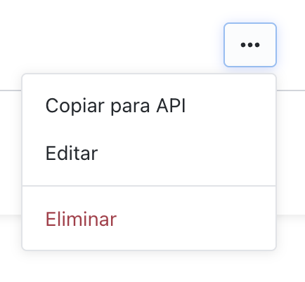

# Campos personalizados

Los campos personalizados permiten adjuntar datos extra a un firmante al [crear un contrato](#crear-un-contrato). El **grupo** (nombre, tipos y validación) se configura en el portal de Keynua. El API de contratos **no crea ni lista grupos**: solo envía, por usuario, un snapshot `customFieldsInfo` que referencia un grupo ya existente.

Cada firmante puede usar un grupo distinto o ninguno. El `name` enviado debe coincidir **exactamente** con el del grupo. El `id` es el identificador del grupo (`customFieldsId`).

## Cómo obtener el payload desde el portal

No existe un listado público de grupos con API Key. Copia el JSON desde la interfaz:

1. Entra a **Organización → Campos personalizados**.
2. En la fila del grupo, abre el menú de acciones y elige **Copiar para API**.



3. Pega el JSON copiado en `users[].customFieldsInfo` del `PUT /contracts/v1`.

<aside class="warning">
<strong>Solo completa cada <code>value</code>.</strong> El JSON copiado ya trae listos el <code>id</code>, el <code>name</code>, las claves de <code>fields</code> y cada <code>label</code>. No los armes ni los cambies: si alteras <code>id</code> o <code>name</code> el API rechaza el contrato.
</aside>

> Así se ve el JSON copiado del portal. Cambia únicamente los `value`:

```json
{
  "id": "11111111-1111-1111-1111-111111111111",
  "name": "Datos laborales",
  "fields": {
    "department": { "value": "", "label": "Departamento" },
    "level": { "value": 0, "label": "Nivel" },
    "region": { "value": "north", "label": "Región" }
  }
}
```

> Después de completar los `value` (esto es lo que envías):

```json
{
  "id": "11111111-1111-1111-1111-111111111111",
  "name": "Datos laborales",
  "fields": {
    "department": { "value": "Legal", "label": "Departamento" },
    "level": { "value": 5, "label": "Nivel" },
    "region": { "value": "lima", "label": "Región" }
  }
}
```

<aside class="success">
Recuerda — En <a href="https://app.stg.keynua.com/profile/organization/custom-fields" target="_blank">Organización → Campos personalizados</a> usa <code>Copiar para API</code> y luego rellena solo cada <code>value</code>.
</aside>

## Tipos de campo

Cada grupo define uno o más campos. Al enviar valores debes respetar el tipo configurado.

Tipo | Valor en `fields` | Validación
--------- | ----------- | -----------
`string` | string | Debe cumplir el `regex` configurado en el grupo
`number` | number | Debe estar entre `minValue` y `maxValue` (inclusive)
`selection` | string | Debe ser el `value` de una de las opciones del campo (no el texto visible)
`optional` | boolean | Si no está o es `false`, el campo es obligatorio. Si el grupo solo tiene campos opcionales, puedes omitir `fields`

## Usar al crear un contrato

```shell
curl --request PUT \
  --url https://api.stg.keynua.com/contracts/v1 \
  --header 'x-api-key: YOUR-API-KEY-HERE' \
  --header 'authorization: YOUR-API-TOKEN-HERE' \
  --header 'content-type: application/json' \
  --data '{
  "title": "Contract with custom fields",
  "language": "es",
  "templateId": "keynua-peru-default",
  "documents": [
    {
      "name": "DocumentPdf.pdf",
      "base64": "YOUR-BASE64-PDF-HERE"
    }
  ],
  "users": [
    {
      "name": "Manuel Silva",
      "email": "msilva@keynua.com",
      "groups": ["signers"],
      "customFieldsInfo": {
        "id": "11111111-1111-1111-1111-111111111111",
        "name": "Datos laborales",
        "fields": {
          "department": { "value": "Legal", "label": "Departamento" },
          "level": { "value": 5, "label": "Nivel" },
          "region": { "value": "north", "label": "Región" }
        }
      }
    },
    {
      "name": "Jane Smith",
      "email": "jane@example.com",
      "groups": ["signers"]
    }
  ]
}'
```

```json
{
  "id": "11111111-1111-1111-1111-111111111111",
  "name": "Datos laborales",
  "fields": {
    "department": { "value": "Legal", "label": "Departamento" },
    "level": { "value": 5, "label": "Nivel" },
    "region": { "value": "north", "label": "Región" }
  }
}
```

Envía `customFieldsInfo` dentro de cada usuario de [Crear un Contrato](#crear-un-contrato). El segundo usuario del ejemplo no lleva campos: es válido.

En el ejemplo de la derecha, `department`, `level` y `region` ya vienen del JSON copiado. Lo único que cambió respecto al portal son los `value`.

### Propiedades de customFieldsInfo

Atributo | Tipo | Descripción
--------- | ----------- | -----------
id | string | Identificador del grupo. Es el valor `customFieldsId` que copia **Copiar para API** en el portal.
name | string | Nombre del grupo. Debe coincidir exactamente con el configurado. Si no coincide, el API responde `CustomFieldsNameMismatch`.
fields | object | `optional` Mapa cuya clave es el `fieldName` del campo. Cada valor es un objeto `{ value, label? }`. Si el grupo tiene campos obligatorios y omites `fields`, el API responde `MissingRequiredFields`.

### Propiedades de un campo en fields

Atributo | Tipo | Descripción
--------- | ----------- | -----------
value | string o number | **Esto es lo único que debes completar** tras copiar el JSON. `string` y `selection` envían string; `number` envía number (no un string numérico).
label | string | `optional` Ya viene en el JSON copiado (`title` del campo). No hace falta editarlo. Si lo omites, el backend usa el `title` del campo.

Las claves de `fields` deben existir en el grupo. Una clave desconocida produce `UnknownCustomField`. Un campo obligatorio ausente produce `MissingCustomField`.

## Errores

Si `customFieldsInfo` no es válido, `PUT /contracts/v1` responde **400** con uno de estos códigos:

Código | Significado
--------- | -----------
CustomFieldsNotFound | El `id` no existe en la organización de la cuenta que crea el contrato
CustomFieldsNameMismatch | El `name` no coincide con el del grupo
MissingCustomField | Falta un campo obligatorio
MissingRequiredFields | El grupo tiene campos obligatorios y no se envió `fields`
UnknownCustomField | Se envió un `fieldName` que no está en el grupo
InvalidCustomFieldType | El tipo de `value` no corresponde al del campo (`string`/`number`)
InvalidCustomFieldFormat | El string no cumple el `regex` del campo
InvalidCustomFieldRange | El number está fuera de `minValue` / `maxValue`
InvalidCustomFieldSelection | El valor no es una opción válida del campo `selection`

## Persistencia

El API guarda un **snapshot** en el usuario del contrato (`id`, `name` y `fields` con values/labels). No se vuelve a consultar el catálogo del portal al firmar: si más tarde editas el grupo, los contratos ya creados conservan lo enviado. Ese snapshot también puede aparecer en el PDF de constancia.

## Lectura en GET y Webhooks

El snapshot viaja con cada firmante que lo recibió al crear el contrato. Si un usuario no tenía `customFieldsInfo`, el atributo **no se incluye** (no llega como `null`).

### GET /contracts/v1/{contractId}

Al [obtener un contrato](#obtener-un-contrato), cada elemento de `users` puede incluir `customFieldsInfo` con la misma forma que enviaste:

```json
{
  "id": 0,
  "name": "Manuel Silva",
  "email": "msilva@keynua.com",
  "groups": ["signers"],
  "customFieldsInfo": {
    "id": "11111111-1111-1111-1111-111111111111",
    "name": "Datos laborales",
    "fields": {
      "department": { "value": "Legal", "label": "Departamento" },
      "level": { "value": 5, "label": "Nivel" },
      "region": { "value": "north", "label": "Región" }
    }
  }
}
```

### Webhooks

Los webhooks reenvían el mismo snapshot en el objeto de usuario. Aparece en:

Evento | Dónde
--------- | -----------
[ContractStarted](#propiedades-de-contractstarted) | `payload.users[]`
[ContractFinished](#propiedades-de-contractfinished) | `payload.users[]`
[ContractUserUpdated](#propiedades-de-un-usuario-userupdated) | `payload.user` y `payload.otherUsers[]`
[ContractItemUpdated](#propiedades-de-contractitemupdated) | `payload.user` (si el item pertenece a un firmante)

> Ejemplo de usuario en `ContractStarted` / `ContractFinished`:

```json
{
  "id": 0,
  "name": "John Doe",
  "email": "example@keynua.com",
  "phone": null,
  "ref": null,
  "groups": ["signers"],
  "customFieldsInfo": {
    "id": "11111111-1111-1111-1111-111111111111",
    "name": "Datos laborales",
    "fields": {
      "department": { "value": "Legal", "label": "Departamento" },
      "level": { "value": 5, "label": "Nivel" },
      "region": { "value": "north", "label": "Región" }
    }
  }
}
```

<aside class="notice">
La forma de <code>customFieldsInfo</code> es la misma en el GET y en los webhooks: es el snapshot guardado al crear el contrato, no el catálogo actual del portal.
</aside>
