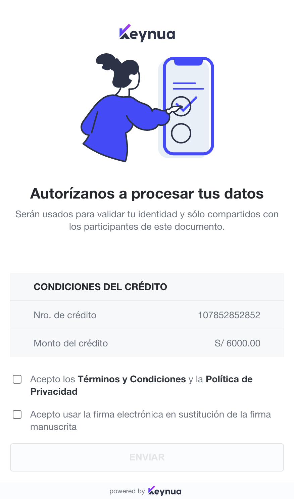
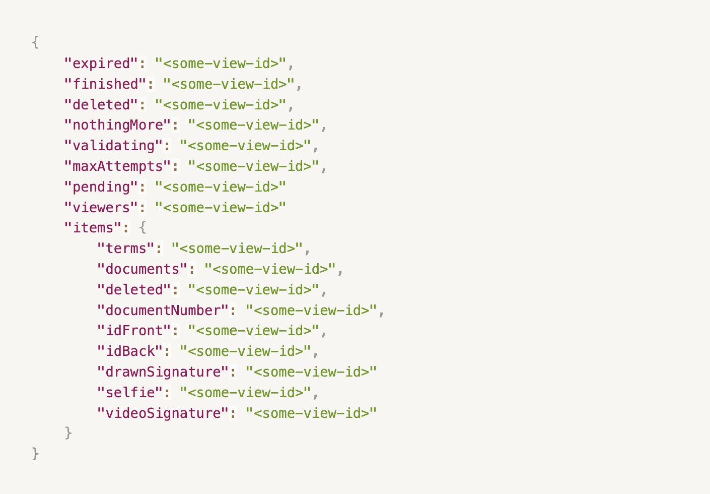

# Introducción

> La URL base de nuestra API es distinta por ambiente:

```shell
Pruebas: https://api.stg.keynua.com
Producción: https://api.keynua.com
```

```ruby
Pruebas: https://api.stg.keynua.com
Producción: https://api.keynua.com
```

```python
Pruebas: https://api.stg.keynua.com
Producción: https://api.keynua.com
```

```javascript
Pruebas: https://api.stg.keynua.com
Producción: https://api.keynua.com
```

Bienvenid@ a la documentación del API de Keynua! Puedes usar nuestro API para poder crear contratos, obtener el detalle del mismo o eliminar contratos.

Algunas características de nuestra API:

* Está basada en REST: los payload para los `request` y `response` deben estar en formato `JSON`
* Solo soporta `HTTPS`

# Autenticación

```shell
curl 'https://api.stg.keynua.com' \
  -H 'x-api-key: YOUR-APIKEY-HERE'
  -H 'authorization: YOUR-API-TOKEN-HERE' \
```

Keynua utiliza **API Keys** y **Authorization tokens** para acceder al API. Una vez ya tengas una cuenta en el ambiente de pruebas de Keynua, puedes acceder a la sección [Developers](https://app.stg.keynua.com/developers) y generar tu APIKey y APIToken. Estos valores deberán ser enviados en la cabecera de la siguiente manera:

Header | Description
--------- | -----------
x-api-key | API Key para acceder al servicio. **Debes usar el valor Secret, NO el ID**
authorization | Token único de autorización. **Debes usar el valor Secret, NO el ID**

<aside class="notice">Si ya estás listo para integrar en producción, por favor contacta al equipo de <code>Keynua</code></aside>

# Contratos
El API de Contratos permite crear, ver y eliminar un contrato
## Propiedades de un Contrato

```json
{
	"id":"some:id",
	"accountId":"someone",
	"templateId":"template-id",
	"createdAt":"2021-01-24T02:52:41.426Z",
	"startedAt":"2021-01-24T02:52:42.347Z",
	"title":"Contract title",
	"description":"Description",
	"finishedAt":null,
	"deletedAt":null,
	"language":"es",
	"metadata":{
		"something":"any-value"
	},
	"reference":"reference",
	"shortCode":"12345",
	"expirationInHours":0,
	"users":User[],
	"groups":Group[],
	"documents":Document[],
	"items":Item[],
	"status":"pending_input"
}
```

Atributo | Tipo | Descripción
--------- | ----------- | -----------
id | string | Identificador único del contrato
accountId | string | Identificador único de la cuenta con la que se creó el contrato
templateId | string | Identificador del Template a usar
createdAt | string | Fecha de creación del contrato
startedAt | string | Fecha de inicio del contrato
title | string | Título del contrato
description | string | Descripción del contrato
finishedAt | string | Fecha de finalización del proceso de firma del contrato
deletedAt | string | Fecha de eliminación del contrato
language | string | Lenguaje del contrato
metadata | object | Metadata del contrato
reference | string | Referencia del contrato. Este campo es usado como clave de búsqueda en la plataforma web de Keynua.
shortCode | string | Código corto del contrato para facilitar su identificación
expirationInHours | integer | Expiración del contrato en horas, a partir de la fecha de inicio del contrato.
expirationDatetime | string | Fecha y hora de expiración del contrato en UTC y formato ISO 8601. Ejemplo: `2021-06-17T19:53:58.551Z`.
users | array | [Usuarios](#propiedades-de-un-usuario) del contrato
groups | array | [Grupos](#propiedades-de-un-grupo) del contrato
documents | array | [Documentos](#propiedades-de-un-documento) del contrato
items | array | [Items](#items-del-contrato) del contrato
status | string | [Estado del contrato](#estados-del-contrato) actual
alerts | array | Arreglo de [Alertas](#propiedades-de-una-alerta) del contrato

### Estados del Contrato

Valor | Descripción
--------- | -----------
pending_input | Estado inicial del contrato, cuando ha sido creado pero aún nadie ha comenzado el proceso de firma
working | Cuando los Items del contrato están en proceso de ejecución
pending_approval | Cuando existe un Item pendiente a ser aprobado manualmente por el dueño del contrato
error | Cuando existe un error sin resolver en uno de los Items del contrato
deleted | Cuando el contrato ha sido eliminado
done | Cuando el contrato ha sido firmado por todos y ha finalizado correctamente

### Propiedades de un Usuario

```json
{
	"id":0,
	"name":"Manuel Silva",
	"email":"msilva@keynua.com",
	"phone":null,
	"groups":[
		"signers"
	],
	"token":"token-value",
	"state": "working",
	"idInfo": {
		"type": "pe-id",
		"idNumber": "12345678",
		"verificationDigit": "9",
		"names": "Juan",
		"lastName": "Perez Alvarez",
		"birthDate": "1992-11-20",
		"expirationDate": "2026-03-17"
		"address": "Some address",
	}
}
```

Usuarios que firman el contrato.

Atributo | Tipo | Descripción
--------- | ----------- | -----------
id | integer | Identificador único del usuario en el contrato
name | string | El nombre del usuario
email | string | El correo electrónico del usuario
phone | string | El teléfono del usuario
groups | array | Nombre de los grupos a los que pertenece el usuario, normalmente siempre pertenece a un sólo grupo. El identificador del grupo será asignado por el equipo de Keynua
token | string | El token del usuario que se utilizará para realizar la firma. Por ejemplo para [actualizar los valores de cada item](#actualizar-el-valor-de-un-item)
state | string | El [estado del usuario](#estados-del-usuario) dentro del contrato, basado en el estado de todos los items del usuario. Solo existe para contratos creados luego del 04/04/2022.
idInfo | string | Información obtenida del OCR del documento enviado por el firmante. Esta información se devolverá solamente cuando el contrato haya finalizado y de momento aplica solamente para las Identificaciones con DNI Peruano. La información de la dirección (address) se devolverá solamente si el usuario también envía la parte trasera del DNI

### Estados del Usuario

Valor | Descripción
--------- | -----------
pending | Estado inicial del usuario. Aún no ha enviado sus datos para la firma.
working | El usuario ya envió sus datos y estos están siendo procesados.
error | Alguno de los ítems del usuario ha presentado un error.
done | Todos los datos del usuario han sido validados y son correctos.

### Propiedades de un Grupo

```json
{
	"id":"signers",
	"name":"Firmantes",
	"description":"",
	"digitalSignature":false,
	"bulk":false
}
```

Grupos que existen en el contrato.

Atributo | Tipo | Descripción
--------- | ----------- | -----------
id | string | Identificador del grupo
name | string | El nombre del grupo
description | string | Descripción del grupo
digitalSignature | boolean | Flag que indica si el grupo realizará firma digital o no
bulk | boolean | Flag que indica si el grupo pertenece a Firma Múltiple o no

### Propiedades de un Documento

```json
{
	"id":0,
	"name":"DocumentPdf.pdf",
	"ext":"pdf",
	"sha":"pdf-hash",
	"size":3708,
	"type":"application/pdf",
	"url":"signed-url"
}
```

Los documentos que son firmados en el contrato.

Atributo | Tipo | Descripción
--------- | ----------- | -----------
id | integer | Identificador único del documento
name | string | Nombre del documento incluyendo su extensión
ext | string | Extensión del documento
sha | string | Código sha256 del documento
size | integer | Tamaño en bytes del documento
type | string | Tipo del documento
url | string | La URL para poder visualizar el documento

## Cavali

```json
{
	"banking": 6,
	"product": 3,
	"uniqueCode": 5478700,
	"issuedDate": "2020-09-20",
	"issuedPlace": "Lima",
	"client": {
	  "userId": 0,
	  "civilStatus": 2,
	  "domicile": "Lima"
	},
	"representatives": [
	  {
		"userId": 1
	  }
	]
}
```

Cavali permite crear un Pagaré y asociarlo a la firma de un contrato. Para crear un contrato, el proceso debe tener un Item Cavali y Item de tipo text con el id `documentNumber`

<aside class="warning">Si quieres crear contratos con Pagarés electrónicos, debes contactar al equipo de soporte de Keynua</aside>

El Pagaré está compuesto por lo siguiente:

Atributo | Tipo | Descripción
--------- | ----------- | -----------
banking | integer | Código de banca
product | integer | Código de producto
uniqueCode | integer | Código único del cliente
creditNumber | integer | Número de crédito
issuedDate | string | Fecha de emisión. Formato: YYYY-MM-dd
conditionJustSign | integer | Condición del pagaré. Puede tener los siguientes valores: 1 (si) | 2 (no)
special | integer | Indicador de pagaré especial. Puede tener los siguientes valores: 1 (si) | 2 (no)
issuedPlace | string | Lugar de emisión
expirationDate | string | Fecha de caducidad. Formato: YYYY-MM-dd
amount | double | Monto del pagaré
currency | integer | Moneda del pagaré. Puede tener los siguientes valores: 1 (S/) | 2 (US$)
compensatoryInterestAmount | double | El interés compensatorio sobre el monto
periodOne | integer | El período de capitalización 1
compensatoryInterestArrears | double | El interés compensatorio por el período de morosidad
periodTwo | integer | El período de capitalización 2
interestArrears | double | Interés moratorio del periodo
periodTwo | integer | El período de capitalización 3
specialClauses | string | Las Cláusulas especiales que pueda contener el Pagaré
token | string | El token de validación de firmas para proveedores
additionalField1 | string | Campo adicional 1
additionalField2 | string | Campo adicional 2
client | object | [Cliente](#cliente-cavali) del Pagaré
representatives | array | Arreglo de [Representantes](#representantes-cavali) del cliente
guarantees | array | Arreglo de [Garantías](#garantías-cavali) del cliente

### Cliente Cavali
El cliente del pagaré. El elemento está compuesto por:

Atributo | Tipo | Descripción
--------- | ----------- | -----------
userId | integer | Id del firmante
civilStatus | integer |  Estado civil del cliente. Puede tener los siguientes valores: `1 (SOLTERO)`, `2 (CASADO)`, `3 (DIVORCIADO)`, `4 (VIUDO)`
domicile | string | Domicilio del cliente `Máximo 100 de longitud`

### Representantes Cavali
Representante del cliente. El elemento está compuesto por:

Atributo | Tipo | Descripción
--------- | ----------- | -----------
userId | integer | Id del firmante

### Garantías Cavali
Garantía del cliente. El elemento está compuesto por:

Atributo | Tipo | Descripción
--------- | ----------- | -----------
userId | integer | Id del firmante
civilStatus | integer | Estado civil. Puede tener los siguientes valores: `1 (SOLTERO)`, `2 (CASADO)`, `3 (DIVORCIADO)`, `4 (VIUDO)`
domicile | string | Domicilio `Máximo 100 de longitud`
representative | array | Arreglo de [Representantes](#representantes-cavali)

## Crear un Contrato

```ruby
require 'uri'
require 'net/http'
require 'openssl'

url = URI("https://api.stg.keynua.com/contracts/v1")

http = Net::HTTP.new(url.host, url.port)
http.use_ssl = true
http.verify_mode = OpenSSL::SSL::VERIFY_NONE

request = Net::HTTP::Put.new(url)
request["authorization"] = 'YOUR-API-TOKEN-HERE'
request["x-api-key"] = 'YOUR-API-KEY-HERE'
request["content-type"] = 'application/json'
request.body = "{\n  \"title\": \"Contract created by API\",\n  \"language\": \"es\",\n  \"userEmailNotifications\": true,\n\t\"templateId\": \"keynua-peru-default\",\n  \"documents\": [\n    {\n      \"name\": \"DocumentPdf.pdf\",\n      \"base64\": \"YOUR-BASE64-PDF-HERE\"\n    }\n  ],\n  \"users\": [\n    {\n      \"name\": \"Manuel Silva\",\n      \"email\": \"msilva@keynua.com\",\n\t\t\"groups\": [ \"signers\" ]\n    }\n  ]\n}\n"

response = http.request(request)
puts response.read_body
```

```python
import http.client

conn = http.client.HTTPSConnection("api.stg.keynua.com")

payload = "{\n  \"title\": \"Contract created by API\",\n  \"language\": \"es\",\n  \"userEmailNotifications\": false,\n\t\"templateId\": \"keynua-peru-default\",\n  \"documents\": [\n    {\n      \"name\": \"DocumentPdf.pdf\",\n      \"base64\": \"YOUR-BASE64-PDF-HERE\"\n    }\n  ],\n  \"users\": [\n    {\n      \"name\": \"Manuel Silva\",\n      \"email\": \"msilva@keynua.com\",\n\t\t\"groups\": [ \"signers\" ]\n    }\n  ]\n}\n"

headers = {
    'x-api-key': "YOUR-API-KEY-HERE",
    'authorization': "YOUR-API-TOKEN-HERE",
    'content-type': "application/json"
    }

conn.request("PUT", "/contracts/v1", payload, headers)

res = conn.getresponse()
data = res.read()

print(data.decode("utf-8"))
```

```shell
curl --request PUT \
  --url https://api.stg.keynua.com/contracts/v1 \
  --header 'x-api-key: YOUR-API-KEY-HERE' \
  --header 'authorization: YOUR-API-TOKEN-HERE' \
  --header 'content-type: application/json' \
  --data '{
  "title": "Contract created by API",
  "language": "es",
  "userEmailNotifications": true,
  "templateId": "keynua-peru-default",
  "documents": [
    {
      "name": "DocumentPdf.pdf",
      "base64": "YOUR-BASE64-PDF-HERE"
    }
  ],
  "users": [
    {
      "name": "Manuel Silva",
      "email": "msilva@keynua.com",
	  "groups": [ "signers" ]
    }
  ]
}'
```

```javascript
const https = require("https");

const data = JSON.stringify({
  title: 'Contract created by API',
  language: 'es',
  userEmailNotifications: true,
  templateId: 'keynua-peru-default',
  documents: [
    {
      name: 'DocumentPdf.pdf',
      base64: 'YOUR-BASE64-PDF-HERE'
    },
  ],
  users: [
    {name: 'Manuel Silva', email: 'msilva@keynua.com', groups: ['signers']}
  ]
});

const options = {
  method: "PUT",
  hostname: "api.stg.keynua.com",
  path: "/contracts/v1",
  headers: {
    "x-api-key": "YOUR-API-KEY-HERE",
    "authorization": "YOUR-API-TOKEN-HERE",
    "content-type": "application/json",
    "content-length": data.length
  }
};

const req = https.request(options, function (res) {
  const chunks = [];

  res.on("data", function (chunk) {
    chunks.push(chunk);
  });

  res.on("end", function () {
    const body = Buffer.concat(chunks);
    console.log(body.toString());
  });
});


req.on('error', (error) => {
  console.error(error)
});

req.write(data);
req.end();
```

> Si el contrato fue creado satisfactoramente, el API retorna un Json estructurado como aparece en la sección de [Contratos](#contratos)

### HTTP Request

`PUT /contracts/v1`

### Headers

Key | Value
--------- | -----------
x-api-key | your-api-key
authorization | your-api-token
Content-Type | application/json

### Body

Para crear el contrato, se tiene que enviar la data como un solo objeto JSON

Atributo | Tipo | Descripción
--------- | ----------- | -----------
title | string | Título del contrato
description | string | `optional` Descripción del contrato
reference | string | `optional` Referencia del contrato. Este campo es usado como clave de búsqueda en la plataforma web de Keynua
language | string |  `Default "es"` Idioma del contrato. Puede ser `en` o `es`
userEmailNotifications | boolean | `Default "false"` Indica si los usuarios serán notificados por email cuando hay un error o finaliza un contrato
expirationInHours | integer | `optional` Expiración del contrato en horas, a partir de la fecha de inicio del contrato. Mínimo uno (1)
expirationDatetime | string | `optional` Fecha y hora de expiración del contrato en UTC y formato ISO 8601. Ejemplo: `2021-06-17T19:53:58.551Z`.
templateId | string | Id del template a usar. Puedes usar uno de los template públicos de Keynua como `keynua-peru-default`. Si es un proceso customizado, el equipo de Keynua te enviará este valor
onBehalfOf | string | AccountId de una cuenta hija. Este campo es usado para organizaciones que necesitan crear contratos como si fueran sus cuentas hijas. Solo funciona si la cuenta hija pertenece a la misma organización de la cuenta padre y si cuenta con el permiso para crear contratos. Los accountId de las cuentas asociadas se pueden obtener [aquí](https://app.keynua.com/profile/organization/?tab=members), ya sea descargando todos los usuarios o copiando los Id que necesites.
documents | array | Arreglo de los documentos PDFs encodificados en base64 que van a ser firmados. Mínimo 1 y máximo 10. El peso máximo en total no debe ser mayor a 4.5 MB. En lugar de `base64` también se puede enviar `storageId`, como por ejemplo se obtiene de [este](#generar-documentos-rellenados) API.
users | array | Arreglo de los usuarios que firmarán el contrato. El email es opcional y el valor a enviar en **groups** depende del templateId a usar. Para el caso de `keynua-peru-default`, el valor en groups debe ser `signers`. Si utilizan un template customizado en el que hay más de un grupo, por ejemplo firmas con DNI + Firma múltiple, el valor del grupo representará al grupo que pertenece dicho usuario
metadata | object | `optional` Metadata del contrato. Puedes enviar información en este campo como key-value para poder identificar el contrato creado por Keynua con algún Identificador interno de tu sistema.
flags | object | `optional` Se podrá enviar información adicional para crear un contrato. Por ejemplo la información de [Cavali](#cavali) para crear un contrato con Pagaré Electrónico se enviará con el key `cavaliData`
templateOptions | object | `optional` [Configuración dinámica del template](#configuracion-dinamica-del-template) del contrato, si mandas este campo se omite el templateId

### Groups y Prefilled Items

```json
{
	"users": [
		{
			"groups": ["firmantes-precargados"],
			"prefilledItems": [
				{
					"target": "documentNumber",
					"value": {
						"text": "444332323"
					}
				}
			],
			"name": "Manuel Silva",
			"email": "msilva@keynua.com"
		},
		{
			"groups": ["firmantes-especiales"],
			"prefilledItems": [
				{
					"target": "role",
					"value": {
						"text": "Cliente"
					}
				}
			],
			"name": "Juan Araujo",
			"email": "jaraujo@keynua.com",
		}
	]
}
```

Para conocer qué datos precargados y grupos de usuarios se pueden usar al crear un contrato, dirígete a la sección [Developers](https://app.stg.keynua.com/developers/).

<aside class="warning">Si has usado la opción de Configuración dinámica del template, puedes saltar este paso ya que el target siempre será "documentNumber"</aside>

En la sección `Grupos e items precargados`, elige un template para ver esta información en formato `JSON`. Un ejemplo de la respuesta puede ser la siguiente:


A la derecha se puede ver cómo corresponde esta respuesta a la información que se debe enviar al crear el contrato.

Algunas observaciones importantes:

* `id` corresponde al nombre al id del grupo, se incluye dentro del arreglo `groups`.
* `target` corresponde al id del valor precargado, se incluye en `target`, dentro del arreglo `prefilledItems`.
* `values` corresponde a los valores admitidos dentro de un valor precargado. Se debe escoger *un solo valor* de esta lista. Debe ir dentro de `text`.
* De no existir `values`, se puede incluir dentro de `text` cualquier valor (relacionado al dato que se desee precargar).


## Obtener un Contrato

```ruby
require 'uri'
require 'net/http'
require 'openssl'

url = URI("https://api.stg.keynua.com/contracts/v1/{contractId}")

http = Net::HTTP.new(url.host, url.port)
http.use_ssl = true
http.verify_mode = OpenSSL::SSL::VERIFY_NONE

request = Net::HTTP::Get.new(url)
request["x-api-key"] = 'YOUR-API-KEY-HERE'
request["authorization"] = 'YOUR-API-TOKEN-HERE'

response = http.request(request)
puts response.read_body
```

```python
import http.client

conn = http.client.HTTPSConnection("api.stg.keynua.com")

headers = {
    'x-api-key': "YOUR-API-KEY-HERE",
    'authorization': "YOUR-API-TOKEN-HERE"
    }

conn.request("GET", "/contracts/v1/{contractId}", "", headers)

res = conn.getresponse()
data = res.read()

print(data.decode("utf-8"))
```

```shell
curl --request GET \
  --url 'https://api.stg.keynua.com/contracts/v1/{contractId}' \
  --header 'x-api-key: YOUR-API-KEY-HERE' \
  --header 'authorization: YOUR-API-TOKEN-HERE' \
```

```javascript
const http = require("https");

const options = {
  "method": "GET",
  "hostname": "api.stg.keynua.com",
  "path": "/contracts/v1/{contractId}",
  "headers": {
    "x-api-key": "YOUR-API-KEY-HERE",
    "authorization": "YOUR-API-TOKEN-HERE"
  }
};

const req = http.request(options, function (res) {
  const chunks = [];

  res.on("data", function (chunk) {
    chunks.push(chunk);
  });

  res.on("end", function () {
    const body = Buffer.concat(chunks);
    console.log(body.toString());
  });
});

req.end();
```

> Si el contrato fue obtenido satisfactoriamente, el API retorna un Json estructurado como aparece en la sección de [Contratos](#contratos)

Este API obtiene un contrato específico

### HTTP Request

`GET /contracts/v1/{contractId}`

### URL Parameters

Parámetro | Descripción
--------- | -----------
contractId | El ID del Contrato a obtener

## Eliminar un Contrato

```ruby
require 'uri'
require 'net/http'
require 'openssl'

url = URI("https://api.stg.keynua.com/contracts/v1/{contractId}")

http = Net::HTTP.new(url.host, url.port)
http.use_ssl = true
http.verify_mode = OpenSSL::SSL::VERIFY_NONE

request = Net::HTTP::Delete.new(url)
request["authorization"] =
request["x-api-key"] = 'YOUR-API-KEY-HERE'
request["authorization"] = 'YOUR-API-TOKEN-HERE'

response = http.request(request)
puts response.read_body
```

```python
import http.client

conn = http.client.HTTPSConnection("api.stg.keynua.com")

headers = {
    'x-api-key': "YOUR-API-KEY-HERE",
    'authorization': "YOUR-API-TOKEN-HERE"
    }

conn.request("DELETE", "/contracts/v1/{contractId}", "", headers)

res = conn.getresponse()
data = res.read()

print(data.decode("utf-8"))
```

```shell
curl --request DELETE \
  --url https://api.stg.keynua.com/contracts/v1/{contractId} \
  --header 'x-api-key: YOUR-API-KEY-HERE' \
  --header 'authorization: YOUR-API-TOKEN-HERE' \
```

```javascript
const https = require("https");

const options = {
  method: "DELETE",
  hostname: "api.stg.keynua.com",
  path: "/contracts/v1/{contractId}",
  headers: {
    "x-api-key": "YOUR-API-KEY-HERE",
    "authorization": "YOUR-API-TOKEN-HERE"
  }
};

const req = https.request(options, function (res) {
  const chunks = [];

  res.on("data", function (chunk) {
    chunks.push(chunk);
  });

  res.on("end", function () {
    const body = Buffer.concat(chunks);
    console.log(body.toString());
  });
});

req.end();
```

> Si el contrato fue eliminado, el API retornará un JSON como el siguiente:

```json
{
  "deletedAt": "2021-01-25T21:38:50.055Z"
}
```

Este API elimina un Contrato

### HTTP Request

`DELETE /contracts/v1/{contractId}`

### URL Parameters

Parámetro | Descripción
--------- | -----------
contractId | El ID del Contrato a eliminar

<aside class="warning">No se puede eliminar un contrato que su estado es <code>done</code>. Si eliminas un contrato que aún no ha sido iniciado por el firmante, la transacción utilizada será reintegrada a tu saldo. Si el contrato ya fue iniciado por el firmante, se tomará como una transacción utilizada.</aside>

## Aprobar un Contrato

```ruby
require 'uri'
require 'net/http'
require 'openssl'

url = URI("https://api.stg.keynua.com/contracts/v1/approve-contract")

http = Net::HTTP.new(url.host, url.port)
http.use_ssl = true
http.verify_mode = OpenSSL::SSL::VERIFY_NONE

request = Net::HTTP::Post.new(url)
request["authorization"] =
request["x-api-key"] = 'YOUR-API-KEY-HERE'
request["authorization"] = 'YOUR-API-TOKEN-HERE'

request = Net::HTTP::Put.new(url)
request["authorization"] = 'YOUR-API-TOKEN-HERE'
request["x-api-key"] = 'YOUR-API-KEY-HERE'
request["content-type"] = 'application/json'
request.body = "{\n  \"contractId\": \"CONTRACT-ID\",\n  \"message\": \"Crédito aprobado\"}\n"

response = http.request(request)
puts response.read_body
```

```python
import http.client

conn = http.client.HTTPSConnection("api.stg.keynua.com")

payload = "{\n  \"contractId\": \"CONTRACT-ID\",\n  \"message\": \"Crédito aprobado\"}\n"


headers = {
    'x-api-key': "YOUR-API-KEY-HERE",
    'authorization': "YOUR-API-TOKEN-HERE"
    'content-type': "application/json"
    }

conn.request("POST", "/contracts/v1/approve-contract", payload, headers)

res = conn.getresponse()
data = res.read()

print(data.decode("utf-8"))
```

```shell
curl --request DELETE \
  --url https://api.stg.keynua.com/contracts/v1/approve-contract \
  --header 'x-api-key: YOUR-API-KEY-HERE' \
  --header 'authorization: YOUR-API-TOKEN-HERE' \
  --header 'content-type: application/json' \
  --data '{
  "contractId": "CONTRACT-ID",
  "message": "Crédito aprobado",
}'
```

```javascript
const https = require("https");

const data = JSON.stringify({
  contractId: 'CONTRACT-ID',
  message: 'Crédito aprobado',
});

const options = {
  method: "POST",
  hostname: "api.stg.keynua.com",
  path: "/contracts/v1/approve-contract",
  headers: {
    "x-api-key": "YOUR-API-KEY-HERE",
    "authorization": "YOUR-API-TOKEN-HERE"
    "content-type": "application/json",
    "content-length": data.length
  }
};

const req = https.request(options, function (res) {
  const chunks = [];

  res.on("data", function (chunk) {
    chunks.push(chunk);
  });

  res.on("end", function () {
    const body = Buffer.concat(chunks);
    console.log(body.toString());
  });
});

req.on('error', (error) => {
  console.error(error)
});

req.write(data);
req.end();
```

> Si el contrato fue aprobado, el API retornará un JSON como el siguiente:

```json
{
  "success": true,
  "item": {
	"itemId": 1,
	"itemState": "s",
	"itemVersion": 1
  }
}
```

Este API Aprueba un Contrato

### HTTP Request

`POST /contracts/v1/approve-contract`

### Body

Parámetro | Descripción
--------- | -----------
contractId | El ID del Contrato a eliminar
message | Motivo de aprobación

# Items del Contrato
Para llevar a cabo el flujo de firma de un contrato, cada uno de los usuarios deberá ingresar la información necesaria para firmar. Por ejemplo: la foto de su DNI, el video diciendo el código corto o el número de su DNI. También hace referencia a los procesos internos llevados a cabo por Keynua, por ejemplo la generación del PDF final o validación biométrica. A cada uno de estos elementos los llamamos **Item**
## Propiedades de un Item

```json
{
	"id": 4,
	"version": 1,
	"state": "success",
	"userId": null,
	"reference": "pdf",
	"title": "Certificado y documentos",
	"type": "pdf",
	"stageIndex": 1,
	"value": {
		"url": "signed-url"
	}
}
```

Atributo | Tipo | Descripción
--------- | ----------- | -----------
id | integer | Identificador del item
version | integer | Versión del item. Siempre se mostrará la última versión disponible
state | string | El estado del item. Puede tener los siguientes valores: `success`, `pending`, `working`, `error`
userId | integer | El identificador del usuario al que está relacionado este item
reference | string | La referencia del item (está relacionado con la plantilla del contrato)
title | string | Un título referente al item
type | string | El ID del [tipo del Item](#tipos-de-item) al que pertenece
stageIndex | integer | El índice del nivel al que pertenece el item
value | object | El valor del item. La estructura varía de acuerdo al tipo del item. Cuando se trata de un Item que contiene un Archivo, habrá un key **url** el cual contiene la URL firmada para poder descargar el archivo. **Las URLs firmadas tienen una duración máxima de 12 horas**. Cuando el item tenga estado Error, se obtendrá el siguiente detalle de [error por tipo de Item](#errores-por-tipo-de-item)

## Tipos de Item
En la siguiente tabla podrás ver los Tipos de Items que existen en Keynua

Item | Id | User Input | Descripción
--------- | ----------- | ----------- | -----------
Términos y condiciones | terms | `si` | Hace  referencia a si el usuario ha aceptado o no los términos y condiciones
Verificación de documentos | documents | `si` | Indica que se le han mostrado los documentos a firmar al usuario
Campo de Texto | text | `si` | Campo de texto ingresado por el usuario o por el creador del contrato, por ejemplo el número de Documento de Identidad
Imagen | image | `si` | Hace referencia a una imagen subida por un usuario, por ejemplo, foto del documento de identidad
Firma Ológrafa | imagesign | `si` | Firma ológrafa realizada por el usuario en el proceso de firma
Video | video | `si` | Video realizado por el usuario, en la mayoría de los casos hace referencia a la videofirma.
Email | email | `no` | Hace referencia al envío del email a un usuario
Reconocimiento de Documento | detectlabels | `no` | Proceso de Reconocimiento del formato de un Documento. Por ejemplo, si se le pide subir a un usuario la foto de su DNI del país y sube la foto de su pasaporte, este proceso detectará que no es el documento solicitado y arrojará un error
Reconocimiento de textos | checklabels | `no` | Este proceso realiza la verificación de textos entre 2 elementos, por ejemplo la búsqueda del documento de identidad ingresado y los textos extraídos de la imagen del documento
Conversión de Video | convertvideo | `no` | Proceso que indica que el video del firmante tiene un formato correcto para ser procesado
Reniec | reniec | `no` | Proceso que indica el resultado de la búsqueda del DNI ingresado en Reniec
Validación de Biometría Facial | facematch | `no` | Proceso que indica la validación Biométrica entre 2 elementos que pueden ser por ejemplo la foto obtenida de RENIEC y la videofirma realizada por el usuario
Reconocimiento de texto hablado | transcribe | `no` | Indica si el usuario dijo como texto hablado el código que corresponde con los documentos que está firmando
Prueba de vida | livenessdetection | `no` | Indica si se detectó vida en el video del usuario
Aprobación Manual| manualapproval | `no` | Indica si hubo una aprobación manual de algún Item como `detectlabels`, `facematch` o `transcribe`
Generación de imágenes para insertar en el PDF final | generatethumbnails | `no` | Proceso que indica si se pudieron obtener los thumbnails necesarios antes de  poder crear el PDF de documento de firma final (Certificado)
Documento de Firma Electrónica/Digital | pdf | `no` | Indica si el archivo PDF de la firma electrónica se generó satisfactoriamente. **En este Item puedes encontrar el PDF final de firma electrónica generado por Keynua**
Firma Digital | dsignature | `no` | Proceso de firma digital aplicado a un archivo de firma electrónica. En este Item puedes encontrar el archivo digital, en caso de que tu proceso incluya firma digital
Cavali - Perú | cavali | `no` | Proceso que indica el registro de un Pagaré electrónico en Cavali para Perú
Blockchain | blockchain | `no` | Proceso que indica si se registró correctamente el hash del documento de firma electrónica final(certificado) en Blockchain
Normativa NOM151 - México | knom151 | `no` | Proceso que indica si se generó correctamente la constancia de conservación según la norma Méxicana NOM151
Firma Múltiple | bulksignature | `no` | Indica si se solicitó firmar al usuario de firma múltiple o si firmó satsifactoriamente. El estado "error" no está implementado por el momento en este Item.

## Errores por tipo de Item

Cuando ocurra un error en un Item, se obtendrán principalmente 2 atributos: `code` y `message`.

> Por ejem:


```json
{
	"code": "NotValidIdCard",
	"message": "El documento de identificación no es válido."
}
```

El valor de `code` depende del tipo de error y tipo de Item como se detalla  a continuación
### documents

Code | Descripción
--------- | -----------
DocumentRejectedBySigner | El usuario rechazó el documento.

<aside class="notice">Para este Item, el valor de <code>message</code> vendría a ser el texto ingresado por la persona que rechazó el documento.</aside>

### reniec

Code | Descripción
--------- | -----------
ReniecFailed | Ha fallado la conexión con Reniec y no fue posible obtener la información.
NotAllowedCancellation | El documento se encuentra cancelado.
NotAllowedRestriction | El documento presenta restricciones por parte de Reniec.
NotAllowedObservation | El documento presenta observaciones por parte de Reniec.
### convertvideo

Code | Descripción
--------- | -----------
ConvertVideoFailed | No ha sido posible procesar el video del firmante. Este error puede ocurrir si el video es inválido.

### detectlabels

Code | Descripción
--------- | -----------
DidNotPass | La imagen procesada no es un documento válido.
DetectLabelsFailed | No ha sido posible detectar el formato esperado ni textos en la imagen.

### checklabels

Code | Descripción
--------- | -----------
unmatchedInputText | El texto ingresado no coincide con la imagen del documento de identificación.
NotValidIdCard | El documento de identificación no es válido.
NotValidExpirationDateInIdCard | La fecha de expiración del documento no es válida.
ExpirationDateNotDetected | No se ha detectado la fecha de expiración en el documento.
NoDetectedTextsInImage | No se pudo detectar ningún texto dentro de la imagen.
DuplicatesFoundInId | Se ha detectado más de un documento de identificación.

### transcribe

Code | Descripción
--------- | -----------
ShortCodeNotFound | Error en el código hablado.
TranscriptionFailed | No fue posible extraer el audio del video.

### facematch

Code | Descripción
--------- | -----------
NotAMatch | La cara del video no coincide con el documento oficial.
SourceFaceNotFound | La cara en la imagen no se pudo encontrar.
FacemasksDetected | Se ha detectado una mascarilla en la imagen.
FaceMatchError | No fue posible encontrar una coincidencia facial.
MarkedAsFraud | Ha sido marcado como un posible fraude por parte de Keynua.

### livenessdetection

Code | Descripción
--------- | -----------
AdminReject | Error obteniendo la prueba de vida del video.
ManyFacesDetected | Han sido detectadas múltiples caras en el video.
ScoreTooLow | El video no ha pasado el score mínimo y debe volver a enviarse.
NoFacesDetected | No se detectó ningún rostro en el video
InvalidPayloadStructure | Error obteniendo la prueba de vida del video.
MarkedAsFraud | Ha sido marcado como un posible fraude por parte de Keynua.

### manualapproval

Code | Descripción
--------- | -----------
ManualApproveRejected | El item ha sido rechazado por el administrador del contrato.

## Actualizar el valor de un item

<aside class="notice">Este procedimiento sólo será realizado en caso quieran construir su propio proceso de firma. Keynua ofrece el proceso de firmar sin costo adicional bajo el propio dominio de Keynua o la posibilidad de incrustar el proceso de firma bajo tu dominio o App móvil mediante nuestro <code><a href="https://github.com/Keynua/public-docs/wiki/Widget">Keynua Widget</a></code></aside>

Para poder actualizar el valor de cada item, se debe utilizar la información que se obtiene luego de crear un certificado o de obtener un certificado por id. Así, podemos saber los tipos (type) de cada item y seguir los siguientes pasos para realizar la actualización.

<aside class="warning">Este procedimiento solo aplica para los items del tipo <code>image</code> y <code>video</code></aside>

### Paso 1: solicitar la información antes de subir un archivo

> Body payload

```json
{
  "token": "some:user:token",
  "name": "some_file.pdf",
  "md5": "9a333cae630cf48165d18a9b1d33f5dd"
}
```

> Si la solicitud fue satisfactoria, la respuesta tendrá la información para que puedas subir el contenido del archivo

```json
{
  "linkId": "some:id",
  "url": "https://some:url:for:upload",
  "method": "PUT",
  "headers": {
    "Content-Type": "image/jpeg",
    "Content-MD5": "solo si se envió md5"
  }
}
```

### HTTP Request

`POST /contracts/v1/sign/upload`

### Headers

Key | Value
--------- | -----------
Content-Type | application/json

### Body

Atributo | Tipo | Descripción
--------- | ----------- | -----------
token | string | El token del usuario del cual se actualizará el item
name | string | El nombre del archivo que se va a subir. Debe incluir su extensión
md5 | string | `opcional` El valor md5 del archivo

### Paso 2: subir el contenido del archivo

```
curl --request PUT \
  --url 'https://some:url:for:upload' \
  --header 'content-type: image/jpeg' \
  --header 'Content-MD5: contentMD5' \
  --data some_file.jpeg
```

> Si no hubo errores al subir el archivo, se retornará el código de estado 200

Con la información obtenida en el paso 1, se subirá el archivo.

### HTTP Request

`POST {URL-STEP-1}`

### Headers

Key | Value
--------- | -----------
Content-Type | {Content-Type-Step-1}
Content-MD5 | contentMD5
### Body

El archivo en Base64

### Paso 3: actualizar el valor del item

```shell
curl --request PUT \
  --url https://api.stg.keynua.com/contracts/v1/sign \
  --header 'content-type: application/json' \
  --data '{
	"token": "USER-TOKEN-HERE",
	"itemId": 2,
	"version": 8,
	"value": {
		"linkId": "LINK-ID-HERE"
	}
}'
```

```javascript
const http = require("https");

const data = JSON.stringify({
  token: 'USER-TOKEN-HERE',
  itemId: 2,
  version: 8,
  value: {
    linkId: 'LINK-ID-HERE'
  }
});

const options = {
  method: "PUT",
  hostname: "api.stg.keynua.com",
  path: "/contracts/v1/sign",
  headers: {
    "content-type": "application/json",
    "content-length": data.length
  }
};

const req = http.request(options, function (res) {
  const chunks = [];

  res.on("data", function (chunk) {
    chunks.push(chunk);
  });

  res.on("end", function () {
    const body = Buffer.concat(chunks);
    console.log(body.toString());
  });
});

req.on('error', (error) => {
  console.error(error)
});

req.write(data);
req.end();
```

```python
import http.client

conn = http.client.HTTPSConnection("api.stg.keynua.com")

payload = "{\n\t\"token\": \"USER-TOKEN-HERE\",\n\t\"itemId\": 2,\n\t\"version\": 8,\n\t\"value\": {\n\t\t\"linkId\": \"LINK-ID-HERE\"\n\t}\n}"

headers = { 'content-type': "application/json" }

conn.request("PUT", "/contracts/v1/sign", payload, headers)

res = conn.getresponse()
data = res.read()

print(data.decode("utf-8"))
```

```ruby
require 'uri'
require 'net/http'
require 'openssl'

url = URI("https://api.stg.keynua.com/contracts/v1/sign")

http = Net::HTTP.new(url.host, url.port)
http.use_ssl = true
http.verify_mode = OpenSSL::SSL::VERIFY_NONE

request = Net::HTTP::Put.new(url)
request["content-type"] = 'application/json'
request.body = "{\n\t\"token\": \"USER-TOKEN-HERE\",\n\t\"itemId\": 2,\n\t\"version\": 8,\n\t\"value\": {\n\t\t\"linkId\": \"LINK-ID-HERE\"\n\t}\n}"

response = http.request(request)
puts response.read_body
```

> Si la actualización fue exitosa, se devolverá el cuerpo del [item](#items-del-contrato) actualizado

En este paso se realizará la actualización de la imagen o el video del item.
### HTTP Request

`PUT /contracts/v1/sign`

### Headers

Key | Value
--------- | -----------
Content-Type | application/json

### Body

Atributo | Tipo | Descripción
--------- | ----------- | -----------
token | string | El token del usuario del cual se actualizará el item
itemId | integer | El identificador del item del que se actualizará el valor
version | integer | La versión del item del que se actualizará el valor
value | object | Dentro del objeto value debes enviar el linkId obtenido en el paso 1 con el key `linkId`
otpToken | string | El token de otp necesario **solo** para los contratos que utilizan otp.

<aside class="notice">Los valores <code>itemId</code> y <code>version</code> del Item se obtienen de la respuesta de crear un Contrato o de obtener un Contrato por id</aside>

## Customizar opciones de un item por usuario

Las opciones de los items que se encuentran establecidas en el template del contrato pueden ser customizadas para un usuario en especifico. Estas se indican para cada tipo de item que el usario tenga asignado en su proceso de firma. Las opciones deben ir dentro del atributo **items** de la **metadata** del usuario durante la creacion del contrato.

Esta configuración de puede aplicar a los siguientes items:

```json
{
	"name": "some:user-name",
	"groups": ["signers"],
	// Some user attributes...
	"metadata": {
		"items": {
			"terms": {
				"table": {
					"title": "CONDICIONES DEL CRÉDITO",
					"items": [
						{
							"title": "Monto del crédito",
							"value": "S/ 6000.00"
						},
						{
							"title": "Fecha del primer pago",
							"value": "28/07/2021"
						},
						// Some items...
					]
				}
			}
		}
	}
}
```

### Terms:



# Configuración dinámica del template

```shell
curl --request PUT \
  --url https://api.stg.keynua.com/contracts/v1 \
  --header 'x-api-key: YOUR-API-KEY-HERE' \
  --header 'authorization: YOUR-API-TOKEN-HERE' \
  --header 'content-type: application/json' \
  --data '{
  "title": "Contract created by API",
  "language": "es",
  "userEmailNotifications": true,
  "templateOptions": {
		"mock": true,
		"classesId": "belcorp-classes-v2",
		"stages": [
		   {
			  "groups": [
				 {
					"name": "Firmantes",
					"type": "signers",
					"views": {
						"nothingMore": "nothing-more-custom",
						"finished": "finished",
						"validating": "validating-custom",
						"items": {
						   "terms": "terms-basic",
						   "documents": "documents-v1",
						   "documentNumber": "document-number-dni",
						   "idFront": "image-front-dni",
						   "idBack": "image-back-dni",
						   "videoSignature": "video-signature"
						}
					},
					"documentSides": "both",
					"documentType": "pe-dni",
					"allowsUpdateItemTypes": [
					   "detectlabels",
					   "facematch",
					   "checklabels"
					],
					"documentValidations": [
					   "verify-content-reniec",
					   "expiration-date"
					],
					"signatureTypes": [
					   "video-signature"
					],
					"allViewsAtOnce": true,
					"prefilledActive": true,
					"workingMessages": {
					   "approvalMessageTitle": "Tu solicitud está en proceso. Por favor comunícate con nuestro Call Center."					},
					"errorMessages": {
					   "contentReniecUnmatchedTitle": "El número del DNI registrado: {documentNumber}, no coincide con el número del DNI de la foto",
					   "contentReniecUnmatchedSubtitle": "Contáctanos para mayor información: belcorp_respondepe@belcorp.biz"
					},
					"dynamicFields": [
						{
							"name": "Foto recibo agua o Luz",
							"type": "image",
							"viewId": "imagereciboview",
							"options": {
								"orientation": "vertical",
								"overlay": true,
								"camera": "environment",
								"invalidExtensions": [
								  ".pdf",
								  ".mp4"
								]
							}
						}
					],
					"minimumScore": {
						"idfront": 30,
						"idback": 30,
						"liveness-detection": 50,
						"idfront-approval": 50,
						"idback-approval": 60,
						"reniec-video-approval": 80,
						"reniec-idfront-approval": 80
					},
					"matchPercent": {
						"reniec-idfront": 30,
						"reniec-video": 60
					},
					"validateMinAge": 18,
					"reviewEachDocument": false,
					"disableNotification": true,
					"disableReminder": true,
					"skipSurveyEmail": true,
					"maskDocumentNumberValue": true
				 }
			  ]
		   }
		]
	},
  "documents": [
    {
      "name": "DocumentPdf.pdf",
      "base64": "YOUR-BASE64-PDF-HERE"
    }
  ],
  "users": [
    {
      "name": "Manuel Silva",
      "email": "msilva@keynua.com",
	  "groups": [ "signers" ]
    }
  ]
}'
```

```javascript
const https = require("https");

const data = JSON.stringify({
  title: 'Contract created by API',
  language: 'es',
  userEmailNotifications: true,
  templateOptions: {
		"mock": true,
		"classesId": "belcorp-classes-v2",
		"stages": [
		   {
			  "groups": [
				 {
					"name": "Firmantes",
					"type": "signers",
					"views": {
						"nothingMore": "nothing-more-custom",
						"finished": "finished",
						"validating": "validating-custom",
						"items": {
						   "terms": "terms-basic",
						   "documents": "documents-v1",
						   "documentNumber": "document-number-dni",
						   "idFront": "image-front-dni",
						   "idBack": "image-back-dni",
						   "videoSignature": "video-signature"
						}
					},
					"documentSides": "both",
					"documentType": "pe-dni",
					"allowsUpdateItemTypes": [
					   "detectlabels",
					   "facematch",
					   "checklabels"
					],
					"documentValidations": [
					   "verify-content-reniec",
					   "expiration-date"
					],
					"signatureTypes": [
					   "video-signature"
					],
					"allViewsAtOnce": true,
					"prefilledActive": true,
					"workingMessages": {
					   "approvalMessageTitle": "Tu solicitud está en proceso. Por favor comunícate con nuestro Call Center."					},
					"errorMessages": {
					   "contentReniecUnmatchedTitle": "El número del DNI registrado: {documentNumber}, no coincide con el número del DNI de la foto",
					   "contentReniecUnmatchedSubtitle": "Contáctanos para mayor información: belcorp_respondepe@belcorp.biz"
					},
					"dynamicFields": [
						{
							"name": "Foto recibo agua o Luz",
							"type": "image",
							"viewId": "imagereciboview",
							"options": {
								"orientation": "vertical",
								"overlay": true,
								"camera": "environment",
								"invalidExtensions": [
								  ".pdf",
								  ".mp4"
								]
							}
						}
					],
					"minimumScore": {
						"idfront": 30,
						"idback": 30,
						"liveness-detection": 50,
						"idfront-approval": 50,
						"idback-approval": 60,
						"reniec-video-approval": 80,
						"reniec-idfront-approval": 80
					},
					"matchPercent": {
						"reniec-idfront": 30,
						"reniec-video": 60
					},
					"validateMinAge": 18,
					"reviewEachDocument": false,
					"disableNotification": true,
					"disableReminder": true,
					"skipSurveyEmail": true,
					"maskDocumentNumberValue": true
				 }
			  ]
		   }
		]
	},
  documents: [
    {
      name: 'DocumentPdf.pdf',
      base64: 'YOUR-BASE64-PDF-HERE'
    },
  ],
  users: [
    {name: 'Manuel Silva', email: 'msilva@keynua.com', groups: ['signers']}
  ]
});

const options = {
  method: "PUT",
  hostname: "api.stg.keynua.com",
  path: "/contracts/v1",
  headers: {
    "x-api-key": "YOUR-API-KEY-HERE",
    "authorization": "YOUR-API-TOKEN-HERE",
    "content-type": "application/json",
    "content-length": data.length
  }
};

const req = https.request(options, function (res) {
  const chunks = [];

  res.on("data", function (chunk) {
    chunks.push(chunk);
  });

  res.on("end", function () {
    const body = Buffer.concat(chunks);
    console.log(body.toString());
  });
});


req.on('error', (error) => {
  console.error(error)
});

req.write(data);
req.end();
```

> Si el contrato fue creado satisfactoramente, el API retorna un Json estructurado como aparece en la sección de [Contratos](#contratos)

Describe las opciones que podemos enviar en el atributo `templateOptions` al crear el contrato

Atributo | Tipo | Descripción
--------- | ----------- | -----------
mock | boolean | Default "false" Indica si es un flujo de prueba, se remueven del flujo las validaciones de identidad
classesId | string | Id del registro de `Custom Classes`
global | objeto | [Configuraciones globales](#configuraciones-globales) del template
stages | array | Contiene las [estapas](#stages) del template

## Configuraciones globales

Atributo | Tipo | Descripción
--------- | ----------- | -----------
maximumSigningAttempts | integer | `optional` Indica la cantidad máxima de intentos de firma de un usuario

## Stages

Los Stages no solo contienen las configuraciones de los grupos, tambien indica cuando inicia la ejecucion de sus items puesto que se ejecutan si y solo si el stage previo finaliza.

Atributo | Tipo | Descripción
--------- | ----------- | -----------
groups | array | Configuraciones de los [grupos](#grupos).

### Grupos

Los grupos incluyen los siguientes tipos: `viewers`, `signers` y `bulk`.

**Viewers**

Atributo | Tipo | Descripción
--------- | ----------- | -----------
name | string | Nombre del grupo, este mismo nombre tendrías que agregarlo a cada usuario que quieras que pertenezca a este gurpo al [crear el contrato](#crear-un-contrato)
type | enum | `viewers`
dynamicFields | array | Agrega [items customizados](#items-customizados) al flujo.
removeUserInput | boolean | Indica si el visor debe completar el input `text` ingresando su nombre o rol en el flujo
rejectDocuments | boolean | Indica si el visor puede rechazar el documento

**Signers**

Atributo | Tipo | Descripción
--------- | ----------- | -----------
name | string | Nombre del grupo, este mismo nombre tendrías que agregarlo a cada usuario que quieras que pertenezca a este gurpo al [crear el contrato](#crear-un-contrato)
type | enum | `signers`
documentType | string | El tipo de documento que se quiere validar. Ver tabla de los [tipos de documentos](#documentos-de-identidad-soportados) soportados
documentSides | string | Lados del documento de identidad. Puede ser `both`, `back` o `frontal`
signatureTypes | array | Indica los tipos de firma. Puede ser `selfie`, `video-signature`, `draw` y `digital-signature`
facematch | array | Indica los items a los cuales se le aplicará el reconocimiento facial. Puede ser `selfie`, `liveness`, `video-signature`, `reniec` y `document-frontal`
liveness3D | boolean | Incluir validación 3D
documentValidations | array | Indica las opciones de validación que puedes agregar a los documentos. Puede ser `verify-content-reniec`, para comparar que los datos de la foto del DNI coincidan con Reniec (Sólo Perú) o `expiration-date`, para comprobar que el documento de identidad no ha expirado aún o `verify-id-number`, para comprobar que el número de documento ingresado en el flujo de firma se encuentre en el documento.
views | object | [Vistas customizadas](#vistas-customizadas) del template
dynamicFields | array | Agrega [items customizados](#items-customizados) al flujo
prefilledActive | boolean | Activa los `prefilled items`, para que el creador del contrato pueda pre-rellenar el número de documento del firmante. Cuando se activa esta opción, el valor que debes ingresar como targetId dentro de cada user es **documentNumber**. Más referencia en la sección de [crear contrato](#crear-un-contrato)
reviewEachDocument | boolean | Indica si se debe debe obligar al firmante a abrir todos los documentos para poder continuar con la firma
disableNotification | boolean | Indica si se quiere omitir el correo de inici
disableReminder | boolean | Indica si se quiere omitir el recordatorio
skipSurveyEmail | boolean | Indica si se quiere omitir la encuesta de satisfacción
allViewsAtOnce | boolean | Esta modalidad muestra todos los pasos del flujo de firma en vertical
maskDocumentNumberValue | boolean | Oculta el número de documento ingresado en caso de error
validateMinAge | number | Edad minima del firmante permitida. Disponible para validaciones gubernamentales
denyInstructionsGrade | boolean | Si activas esta opción, se devolverá un error si el DNI evaluado tiene el grado de Instrucción de Iletrado o Educación Especial. **Para contratos, esta opción está activa por defecto y no se puede cambiar**
minimumScore | objeto | Customizar la sensibilidad de las validaciones de identidad. Para más detalle consultar la sección [Customizar validaciones](#customizar-validaciones)
matchPercent | objeto | Customizar la sensibilidad de las validaciones de reconocimiento facial. Para más detalle consultar la sección [Customizar validaciones](#customizar-validaciones)
workingMessages | objeto | Customizar mensajes del flujo de firma en progreso. Para más detalle consultar la sección [Customizar mensajes](#customizar-mensajes)
errorMessages | objeto | Customiar mensaje de error del flujo de firma. Para más detalle consultar la sección [Customizar mensajes](#customizar-mensajes)

**Bulk (Firma gerentes)**

Atributo | Tipo | Descripción
--------- | ----------- | -----------
name | string | Nombre del grupo, este mismo nombre tendrías que agregarlo a cada usuario que quieras que pertenezca a este gurpo al [crear el contrato](#crear-un-contrato)
type | enum | `bulk`
requiredItems | array | El arreglo puede contener los siguientes elementos: `video`, `imagesign`, `visto` e `image`

### Vistas customizadas

Las vistas personalizadas permiten modificar la apariencia del Widget dinámicamente.

El atributo de `views` debe completarse con la siguiente estructura:



Nombre | Descripción
--------- | -----------
`expired` | Personalizar vista de expiración del contrato
`finished` | Personalizar vista de finalización del contrato
`deleted` | Personalizar vista de contrato eliminado
`nothingMore` | Personalizar vista de firma enviada
`validating` | Personalizar vista de validación de firma
`maxAttempts` | Personalizar vista de bloqueo por máximo de intentos de firma
`pending` | Personalizar vista de flujo de firma pendiente
`viewers` | Personalizar vista de Vistos buenos
`terms` | Vista asignada al `input` de términos y condiciones.
`documents` | Vista asignada al `input` de Documentos.
`documentNumber` | Vista asignada al `input` de Número de documento.
`idFront` | Vista asignada al `input` de Foto frotal del documento de identidad.
`idBack` | Vista asignada al `input` de Foto posterior del documento de identidad.
`drawnSignature` | Vista asignada al `input` de firma dibujada.
`selfie` | Vista asignada al `input` de Foto Selfie.
`videoSignature` | Vista asignada al `input` de Video firma.

### Items customizados

Los items customizado tienen una estructura base en cual cambian los `options` acorde a su tipo. Los tipos disponibles: `image`, `text` y `video`.

Atributo | Tipo | Descripción
--------- | ----------- | -----------
name | string | Nombre del item
type | string | Puede ser `image`, `text` o `video`
prefilledId | string | Si tenemos el atributo `prefilledActive` activado podemos especificar el id de referencia para ingresar el valor del item
viewId | string | Id de la vista customizada
options | object | Opciones del item

Opciones del item:

- Imagen (`image`)

Atributo | Tipo | Descripción
--------- | ----------- | -----------
btnLabel | string | Texto del botón principal
invalidExtensions | array | Extensiones inválidas
placeholderImgName | string | Id de la ilustración del item
orientation | string | Orientación de la cámara. Puede ser `horizontal` o `vertical`
camera | string | Tipo de cámara. Puede ser `environment` o `user`

* Texto (`text`)

Atributo | Tipo | Descripción
--------- | ----------- | -----------
regex | string | Validación del formato
type | string | Tipo del input. Puede ser `text`, `number` o `tel`
minLength | number | Longitud máxima del input
maxLength | number | Longitud mínima del input

+ Video (`video`)

Atributo | Tipo | Descripción
--------- | ----------- | -----------
btnLabel | string | Texto del botón principal
invalidExtensions | array | Extensiones inválidas
placeholderImgName | string | Id de la ilustración del item
orientation | string | Orientación de la cámara. Puede ser `horizontal` o `vertical`
camera | string | Tipo de cámara. Puede ser `environment` o `user`
hideNativeButton | boolean | Oculta botón de la cámara nativa

### Customizar mensajes

Customizar mensajes de un flujo en proceso:

Atributo | Tipo | Descripción
--------- | ----------- | -----------
approvalMessageTitle | string | Título de la aprobación manual
approvalMessageSubtitle | string | Subtítulo de la aprobación manual

Customizar mensajes de error:

Atributo | Tipo | Descripción
--------- | ----------- | -----------
idNumberUnmatchedTitle | string | Título del mensaje cuando el número de documeto es inválido
idNumberUnmatchedSubtitle | string | Subtítulo del mensaje cuando el número de documeto es inválido
contentReniecUnmatchedTitle | string | Título del mensaje cuando el contenido del documento es inválido
contentReniecUnmatchedSubtitle | string | Subtítulo del mensaje cuando el contenido del documento es inválido

### Customizar validaciones

Customizar validaciones de identidad:

Atributo | Tipo | Descripción
--------- | ----------- | -----------
idfront | number | Validación del formato frontal del documento
idback | number | Validación del formato posterior del documento
idfront-approval | number | Aprobación manual de la parte frontal del documento
idback-approval | number | Aprobación manual de la parte posterior del documento
liveness-detection | number | Aprobación manual de la prueba de vida
video-idfront-approval | number | Aprobación manual entre video y la parte frontal del documento
reniec-idfront-approval | number | Aprobación manual entre reniec y la parte frontal del documento
reniec-video-approval | number | Aprobación manual entre reniec y la video firma
reniec-liveness-approval | number | Aprobación manual entre reniec y prueba de vida
video-liveness-approval | number | Aprobación manual entre video firma y prueba de vida
selfie-reniec-approval | number | Aprobación manual entre selfie y reniec
selfie-idfront-approval | number | Aprobación manual entre selfie y la parte frontal del documento

Customizar validaciones de reconocimiento facial:

Atributo | Tipo | Descripción
--------- | ----------- | -----------
video-idfront | number | Facematch entre video firma y la parte frontal del documento
reniec-idfront | number | Facematch entre reniec y la parte frontal del documento
reniec-video | number | Facematch entre reniec y video firma
reniec-liveness | number | Facematch entre reniec y prueba de vida
video-liveness | number | Facematch entre video firma y prueba de vida
selfie-reniec | number | Facematch entre selfie y reniec
selfie-idfront | number | Facematch entre selfie y la parte frontal del documento

# Documentos de identidad soportados

id | Descripción
--------- | -----------
`pe-dni` | Documento de identidad Perú
`pe-ce` | Carné de extrangerīa Perú
`passport` | Pasaporte
`co-cedula` | Cédula Colombiana
`br-denatran` | Denatran Brasil
`cl-cedula` | Cédula Chile
`mx-ife` | Documento de identidad Mexico (IFE)
`sv-dui` | DUI (El Salvador)
`pa-id` | Cédula panameña
`ar-id` | Cédula argentina
`br-id` | Cédula brasilera
`bo-id` | Cédula boliviana
`cr-id` | Cédula costarricense
`cu-id` | Cédula cubana
`ec-id` | Cédula ecuatoriana
`gt-id` | Cédula guatemalteca
`hn-id` | Cédula hondureña
`ni-id` | Cédula nicaraguense
`py-id` | Cédula paraguaya
`pr-id` | Cédula puertorriqueña
`do-id` | Cédula dominicana
`uy-id` | Cédula uruguaya
`us-id` | Licencia de conducir
`ve-id` | Cédula venezolana
`ch-cedula` | Cédula chilena
`global` | Global

# Deceval

Permite asociar un Pagaré emitido en el sistema de Deceval a un contrato.

<aside class="warning">Si quieres crear contratos con Deceval, debes contactar al equipo de soporte de Keynua</aside>

## Restricciones

1. El objeto `decevalData` se debe agregar a los flags en la [creación del contrato](#crear-un-contrato).
1. Todos los usuarios del contrato que se agregan mediante el atributo `users` deben pertenecer al grupo de firmantes del proceso si y solo si participan en el Pagaré.

## Flujo de firma

1. Registrar giradores.
1. Creación del Pagaré en Deceval.
1. Usuario realiza la firma del contrato mediante el Widget de keynua.
1. Se ejecuta el item de firma Deceval: Este item usa la accion "FirmarPagares" del servicio de
Deceval para registrar la firma del participante.
1. Se ejecuta el item de validación del Pagaré: consulta el estado del Pagaré en el sistema de Deceval mediante la acción "ConsultarPagares" para guardar el documento generado en el contrato y adjuntarlo al pdf final.

## Crear girador natural

```ruby
require 'uri'
require 'net/http'
require 'openssl'

url = URI("https://api.stg.keynua.com/deceval/v1/crear-girador-natural")

http = Net::HTTP.new(url.host, url.port)
http.use_ssl = true
http.verify_mode = OpenSSL::SSL::VERIFY_NONE

request = Net::HTTP::POST.new(url)
request["authorization"] = 'YOUR-API-TOKEN-HERE'
request["x-api-key"] = 'YOUR-API-KEY-HERE'
request["content-type"] = 'application/json'
request.body = "{\n  \"girador\": {\n    \"nombresNat_Nat\": \"Nombre\",\n    \"correoElectronico\": \"prueba@example.com\",\n    \"primerApellido_Nat\": \"Apellido 1\",\n    \"segundoApellido_Nat\": \"Apellido 2\",\n    \"numeroCelular\": \"2348458734\",\n    \"estadoCivil\": \"soltero\",\n    \"direccion1PersonaGrupo_PGP\": \"Domicilio 1\",\n    \"telefono1PersonaGrupo_PGP\": \"3495852343\",\n    \"fechaExpedicion_Nat\": \"2021-09-01\",\n    \"fechaNacimiento_Nat\": \"2021-09-01\",\n    \"fkIdDepartamentoExpedicion_Nat\": \"11\",\n    \"fkIdCiudadExpedicion_Nat\": \"11001\",\n    \"fkIdTipoDocumento\": \"1\",\n    \"numeroDocumento\": \"523642456\"\n  }\n}"

response = http.request(request)
puts response.read_body
```

```python
import http.client

conn = http.client.HTTPSConnection("api.stg.keynua.com")

payload = "{\n  \"girador\": {\n    \"nombresNat_Nat\": \"Nombre\",\n    \"correoElectronico\": \"prueba@example.com\",\n    \"primerApellido_Nat\": \"Apellido 1\",\n    \"segundoApellido_Nat\": \"Apellido 2\",\n    \"numeroCelular\": \"2348458734\",\n    \"estadoCivil\": \"soltero\",\n    \"direccion1PersonaGrupo_PGP\": \"Domicilio 1\",\n    \"telefono1PersonaGrupo_PGP\": \"3495852343\",\n    \"fechaExpedicion_Nat\": \"2021-09-01\",\n    \"fechaNacimiento_Nat\": \"2021-09-01\",\n    \"fkIdDepartamentoExpedicion_Nat\": \"11\",\n    \"fkIdCiudadExpedicion_Nat\": \"11001\",\n    \"fkIdTipoDocumento\": \"1\",\n    \"numeroDocumento\": \"523642456\"\n  }\n}"

headers = {
    'x-api-key': "YOUR-API-KEY-HERE",
    'authorization': "YOUR-API-TOKEN-HERE",
    'content-type': "application/json"
    }

conn.request("POST", "/deceval/v1/crear-girador-natural", payload, headers)

res = conn.getresponse()
data = res.read()

print(data.decode("utf-8"))
```

```shell
curl --request POST \
  --url https://api.stg.keynua.com/deceval/v1/crear-girador-natural \
  --header 'x-api-key: YOUR-API-KEY-HERE' \
  --header 'authorization: YOUR-API-TOKEN-HERE' \
  --header 'content-type: application/json' \
  --data '{
  "girador": {
    "nombresNat_Nat": "Nombre",
    "correoElectronico": "prueba@example.com",
    "primerApellido_Nat": "Apellido 1",
    "segundoApellido_Nat": "Apellido 2",
    "numeroCelular": "2348458734",
    "estadoCivil": "soltero",
    "direccion1PersonaGrupo_PGP": "Domicilio 1",
    "telefono1PersonaGrupo_PGP": "3495852343",
    "fechaExpedicion_Nat": "2021-09-01",
    "fechaNacimiento_Nat": "2021-09-01",
    "fkIdDepartamentoExpedicion_Nat": "11",
    "fkIdCiudadExpedicion_Nat": "11001",
    "fkIdTipoDocumento": "1",
    "numeroDocumento": "523642456"
  }
}'
```

```javascript
const https = require("https");

const data = JSON.stringify({
  girador: {
    nombresNat_Nat: 'Nombre',
    correoElectronico: 'prueba@example.com',
    primerApellido_Nat: 'Apellido 1',
    segundoApellido_Nat: 'Apellido 2',
    numeroCelular: '2348458734',
    estadoCivil: 'soltero',
    direccion1PersonaGrupo_PGP: 'Domicilio 1',
    telefono1PersonaGrupo_PGP: '3495852343',
    fechaExpedicion_Nat: '2021-09-01',
    fechaNacimiento_Nat: '2021-09-01',
    fkIdDepartamentoExpedicion_Nat: '11',
    fkIdCiudadExpedicion_Nat: '11001',
    fkIdTipoDocumento: '1',
    numeroDocumento: '523642456'
  }
});

const options = {
  method: "POST",
  hostname: "api.stg.keynua.com",
  path: "/deceval/v1/crear-girador-natural",
  headers: {
    "x-api-key": "YOUR-API-KEY-HERE",
    "authorization": "YOUR-API-TOKEN-HERE",
    "content-type": "application/json",
    "content-length": data.length
  }
};

const req = https.request(options, function (res) {
  const chunks = [];

  res.on("data", function (chunk) {
    chunks.push(chunk);
  });

  res.on("end", function () {
    const body = Buffer.concat(chunks);
    console.log(body.toString());
  });
});


req.on('error', (error) => {
  console.error(error)
});

req.write(data);
req.end();
```

> Los participantes del Pagaré deben ser registrados como giradores antes de crear un proceso de firma con Deceval.

### HTTP Request

`POST /deceval/v1/crear-girador-natural`
### Headers

Key | Value
--------- | -----------
x-api-key | your-api-key
authorization | your-api-token
Content-Type | application/json

### Body

Para crear el girador, se tiene que enviar la data como un objeto JSON

Atributo | Tipo | Descripción
--------- | ----------- | -----------
nombresNat_Nat | string | Nombres
correoElectronico | string | Correo electrónico
primerApellido_Nat | string | Primer apellido
segundoApellido_Nat | string |  Segundo apellido
fkIdTipoDocumento | string | Tipo de documento. Puede tener los siguientes valores: `"1" (CEDULA DE CIUDADANIA)` , `"2" (CEDULA DE EXTRANJERIA)`
numeroDocumento | string | Número de documento
numeroCelular | string | Número de celular
estadoCivil | string | Estado civil
direccion1PersonaGrupo_PGP | string | Dirección de domicilio
telefono1PersonaGrupo_PGP | string | Teléfono
fechaNacimiento_Nat | string | Fecha de nacimiento. Formato: YYYY-MM-dd
fechaExpedicion_Nat | string | Fecha de expedición. Formato: YYYY-MM-dd
fkIdDepartamentoExpedicion_Nat | string | Departamento de expedición
fkIdCiudadExpedicion_Nat | string | Cuidad de expedición

## Consultar girador

```ruby
require 'uri'
require 'net/http'
require 'openssl'

url = URI("https://api.stg.keynua.com/deceval/v1/obtener-girador")

http = Net::HTTP.new(url.host, url.port)
http.use_ssl = true
http.verify_mode = OpenSSL::SSL::VERIFY_NONE

request = Net::HTTP::POST.new(url)
request["authorization"] = 'YOUR-API-TOKEN-HERE'
request["x-api-key"] = 'YOUR-API-KEY-HERE'
request["content-type"] = 'application/json'
request.body = "{\n    \"idClasePersona\": \"1\",\n    \"tipoDocumento\": \"1\",\n    \"numeroDocumento\": \"523642456\"\n    }"

response = http.request(request)
puts response.read_body
```

```python
import http.client

conn = http.client.HTTPSConnection("api.stg.keynua.com")

payload = "{\n    \"idClasePersona\": \"1\",\n    \"tipoDocumento\": \"1\",\n    \"numeroDocumento\": \"523642456\"\n    }"

headers = {
    'x-api-key': "YOUR-API-KEY-HERE",
    'authorization': "YOUR-API-TOKEN-HERE",
    'content-type': "application/json"
    }

conn.request("POST", "/deceval/v1/crear-girador-natural", payload, headers)

res = conn.getresponse()
data = res.read()

print(data.decode("utf-8"))
```

```shell
curl --request POST \
  --url https://api.stg.keynua.com/deceval/v1/obtener-girador \
  --header 'x-api-key: YOUR-API-KEY-HERE' \
  --header 'authorization: YOUR-API-TOKEN-HERE' \
  --header 'content-type: application/json' \
  --data '{
    "idClasePersona": "1",
    "tipoDocumento": "1",
    "numeroDocumento": "523642456",
}'
```

```javascript
const https = require("https");

const data = JSON.stringify({
    "idClasePersona": "1",
    "tipoDocumento": "1",
    "numeroDocumento": "523642456",
});

const options = {
  method: "POST",
  hostname: "api.stg.keynua.com",
  path: "deceval/v1/obtener-girador",
  headers: {
    "x-api-key": "YOUR-API-KEY-HERE",
    "authorization": "YOUR-API-TOKEN-HERE",
    "content-type": "application/json",
    "content-length": data.length
  }
};

const req = https.request(options, function (res) {
  const chunks = [];

  res.on("data", function (chunk) {
    chunks.push(chunk);
  });

  res.on("end", function () {
    const body = Buffer.concat(chunks);
    console.log(body.toString());
  });
});


req.on('error', (error) => {
  console.error(error)
});

req.write(data);
req.end();
```
### HTTP Request

`POST /deceval/v1/obtener-girador`

### Headers

Key | Value
--------- | -----------
x-api-key | your-api-key
authorization | your-api-token
Content-Type | application/json

### Body

Para obtener el girador, se tiene que enviar la data como un objeto JSON

Atributo | Tipo | Descripción
--------- | ----------- | -----------
idClasePersona | string | Tipo de girador. Puede tener los siguientes valores: `"1" (NATURAL)` , `"2" (JURIDICO)`
numeroDocumento | string | Número de documento
tipoDocumento | string | Tipo de documento. Puede tener los siguientes valores: `"1" (CEDULA DE CIUDADANIA)` , `"2" (CEDULA DE EXTRANJERIA)`

## Estructura del Pagaré

>`decevalData`

```json
{
	"flags": {
		"decevalData": {
			"promissoryNote": {
				"tipoPagare": "2",
				"numCredito": "964234",
				"fechaVencimientoFinanciero": "2021-08-13",
				"numReferencia": "985462",
				"numPagareEntidad": "642345",
				"creditoReembolsableEn": 2,
				"valorPesosDesembolso": 10000,
				"valorPesosDesembolsoLetras": "DIEZ MIL",
				"otorganteNumId": "444332323",
				"otorganteTipoId": "1",
				"apoderadoNumId": "754345789",
				"apoderadoTipoId": "1",
				"listaCodeudoresAvalistasPagare": [
					{
						"giradorNumId": "048918289",
						"idRol": "6",
						"giradorTipoId": "1"
					},
					{
						"giradorNumId": "453456345",
						"idRol": 7,
						"giradorTipoId": "1"
					}
				],
				"ciudadCreacion": "11001",
				"deptoCreacion": "11",
				"paisCreacion": "CO"
			}
		}
  	}
}
```

> `users`

```json
{
	"users": [
		{
			"groups": [ "signers" ],
			"prefilledItems": [
				{
					"target": "documentNumber",
					"value": { "text": "444332323" }
				}
			],
			"name": "Nombres y Apellidos 1",
			"email": "correo1@ejemplo.com"
		},
		{
			"groups": [ "signers" ],
			"prefilledItems": [
				{
					"target": "documentNumber",
					"value": { "text": "754345789" }
				}
			],
			"name": "Nombres y Apellidos 2",
			"email": "correo2@ejemplo.com"
		},
		{
			"groups": [ "signers" ],
			"prefilledItems": [
				{
					"target": "documentNumber",
					"value": { "text": "048918289" }
				}
			],
			"name": "Nombres y Apellidos 3",
			"email": "correo3@ejemplo.com"
		},
		{
			"groups": [ "signers" ],
			"prefilledItems": [
				{
					"target": "documentNumber",
					"value": { "text": "453456345" }
				}
			],
			"name": "Nombres y Apellidos 4",
			"email": "correo4@ejemplo.com"
		}
  	]
}
```

### promissoryNote:
Detalle del pagaré. El elemento está compuesto por:

Atributo | Tipo | Descripción
--------- | ----------- | -----------
tipoPagare | string | Tipo de Pagaré. Puede tener los siguientes valores: `"1" (Diligenciado)` , `"2" (En blanco con carta de instrucciones)`.
numCredito | string | Número de crédito
fechaVencimientoFinanciero | string | Fecha de vencimiento. Formato: YYYY-MM-dd
numReferencia | string | Número de referencia
numPagareEntidad | string | Número del Pagaré de la entidad
creditoReembolsableEn | integer | Indica el tipo de moneda del desembolso. Puede tener los siguientes valores: `1 (EnURV)` , `2 (En Pesos)` , `3 (En Dólares)` , 4 `(Otros)`
valorPesosDesembolso | integer | Valor de desembolso
valorPesosDesembolsoLetras | string | Valor de desembolso representado en texto
otorganteTipoId | string | Tipo de documento del apoderado.  Puede tener los siguientes valores: `"1" (CEDULA DE CIUDADANIA)` , `"2" (CEDULA DE EXTRANJERIA)`.
otorganteNumId | string | Número de documento del otorgante
apoderadoTipoId | string | Tipo de documento del apoderado.  Puede tener los siguientes valores: `"1" (CEDULA DE CIUDADANIA)` , `"2" (CEDULA DE EXTRANJERIA)`.
apoderadoNumId | string | Número de documento del apoderado
ciudadCreacion | string | Cuidad de creacion del Pagaré
deptoCreacion | string | Departamento de creación del Pagaré
paisCreacion | string | Pais de creación del Pagaré
listaCodeudoresAvalistasPagare | [CodeudoresAvalistas[]](#CodeudoresAvalistas) | Lista de codeudores y avalistas

### CodeudoresAvalistas
El codeudor o avalista del pagaré. El elemento está compuesto por:

Atributo | Tipo | Descripción
--------- | ----------- | -----------
giradorTipoId | string | Tipo de documento del apoderado.  Puede tener los siguientes valores: `"1" (CEDULA DE CIUDADANIA)` , `"2" (CEDULA DE EXTRANJERIA)`.
idRol | string | Rol del participante. Puede tener los siguientes valores: `"6" (Codeudor)` , `"7" (Avalista)`
giradorNumId | string | Nùmero de documento del participante

# Verificación de identidad

Permite crear, listar y obtener verificaciones de identidad.

## Propiedades de una verificación de identidad

```json
{
  "userRealName": "JOHN, DOE",
  "status": "done",
  "finishedAt": "2021-04-26T23:03:50.272Z",
  "language": "es",
  "reference": "123456789",
  "expirationInHours": 0,
  "startedAt": "2021-04-26T23:02:08.500Z",
  "contractId": "6afe9bb0-a6e3-11eb-9a2c-11fc3348624ae1",
  "documentNumber": "123456789",
  "id": "88b93325-82c4-40aa-9606-f49c757382ae",
  "accountId": "48101c38-f770-4ea8-88ab-258e672d88bd",
  "userEmail": "user_email@gmail.com",
  "countryCode": "pe",
  "userToken": "eyJ0eXAiOiJKV1QiLCJhbGciOiJIUzI1NiJ9...ZlOWJiMC1hNmUzLTExZWItOWEyYy0xMWZjMzM0ODYyNGFlMS",
  "createdAt": "2021-04-26T23:02:02.309Z",
  "accountEmail": "user@keynua.com",
  "organizationId": "48101c38-f770-4ea8-88ab-258e672d88bd",
  "updatedAt": "2021-05-18T22:40:05.851Z",
  "userFullName": null,
  "accountName": "Patrick Star",
  "timezone": "America/Lima",
  "title": "Identification 123456789",
  "userIdInfo": {
	"type": "pe-id",
	"idNumber": "12345678",
	"verificationDigit": "9",
	"names": "Juan",
	"lastName": "Perez Alvarez",
	"birthDate": "1992-11-20",
	"expirationDate": "2026-03-17"
	"address": "Some address",
  },
  "items": ContractItem[]
}
```

Atributo | Tipo | Opcional | Descripción
--------- | ----------- | ----------- | -----------
userRealName | string | No | Nombre completo del usuario
status | string | No | `pending`, `pending_input`, `pending_approval`, `working`, `error`, `done`, `deleted`, `max_attempts`, o `expired`
finishedAt | string | Sí | Fecha y hora de finalización en formato ISO
language | string | No | Lenguaje con el cual se completará el proceso de identificación
reference | string | Sí | Campo libre. Útil para realizar búsquedas.
expirationInHours | string | Sí | En cuantas horas luego de la creación, la verificación expirará. `0` no expira.
startedAt | string | Sí | Fecha y hora en formato ISO del momento en que la verificación está lista para ser completada.
contractId | string | No | Id interno
documentNumber | string | No | Número de documento nacional de identificación
id | string | No | Identificador único de la verificación
accountId | string | No | Id de la cuenta que creó la verificación
userEmail | string | Sí | Email del verificante en el cual recibirá el link de inicio del proceso
userPhone | string | Sí | Teléfono celular del verificante en el cual recibirá el link de inicio del proceso
countryCode | string | No | Código del país en el que se realiza la verificación
userToken | string | No | Token con el cual se puede armar el link donde se realizará la verificación. Por ejemplo: `https://sign.keynua.com/index.html?token={token}`
createdAt | string | No | Fecha y hora de creación en formato ISO
accountEmail | string | No | Email de la cuenta que creó la verificación
organizationId | string | Sí | Id de la organización en la que se creó la verificación
updatedAt | string | No | Última fecha y hora en formato ISO en la que se realizó alguna modificación
userFullName | string | Sí | Nombre completo de la persona
accountName | string | No | Nombre de la cuenta que creó la verificación
timezone | string | No | Huso horario  utilizado en notificaciones y mensajes
title | string | No | Título de la verificación
userIdInfo | string | Sí | Información obtenida del OCR del documento enviado por el firmante. Esta información se devolverá solamente cuando la Identificación haya finalizado y de momento solo aplica para las Identificaciones Peruanas. La información de la dirección (address) se devolverá solamente si el usuario también envía la parte trasera del DNI
items | [ContractItem](#items-del-contrato)[] | No | Lista de pasos que sigue la verificación.

## Crear verificación de identidad

```shell
curl --location --request PUT 'https://api.keynua.com/identity-verification/v1' \
  --header 'x-api-key: YOUR-API-KEY-HERE' \
  --header 'authorization: YOUR-API-TOKEN-HERE' \
  --header 'Content-Type: application/json' \
  --data-raw '{
    "documentNumber": "12345678",
    "userPhone": "51123456789",
    "userFullName": "Patrick Star",
    "title": "Identification 12345678",
    "type": "video",
    "documentType": "pe-dni",
    "disableInitialNotification": false,
    "validateDocument": true
  }'
```

```ruby
require "uri"
require "net/http"

url = URI("https://api.dev.keynua.com/identity-verification/v1")

https = Net::HTTP.new(url.host, url.port)
https.use_ssl = true

request = Net::HTTP::Put.new(url)
request["x-api-key"] = 'YOUR-API-KEY-HERE'
request["authorization"] = 'YOUR-API-TOKEN-HERE'
request["Content-Type"] = "application/json"
request.body = "{\n  \"documentNumber\": \"12345678\",\n  \"userPhone\": \"51123456789\",\n  \"userFullName\": \"Patrick Star\",\n  \"title\": \"Identification 12345678\",\n  \"type\": \"video\",\n \"documentType\": \"pe-dni\",\n \"disableInitialNotification\": \"false\",\n \"validateDocument\": \"true\"\n}"

response = https.request(request)
puts response.read_body
```

```python
import http.client
import json

conn = http.client.HTTPSConnection("api.keynua.com")
payload = json.dumps({
    "documentNumber": "12345678",
    "userPhone": "51123456789",
    "userFullName": "Patrick Star",
    "title": "Identification 12345678",
    "type": "video",
    "documentType": "pe-dni",
    "disableInitialNotification", "false",
    "validateDocument": "true",
})
headers = {
  'x-api-key': "YOUR-API-KEY-HERE",
  'authorization': "YOUR-API-TOKEN-HERE",
  'Content-Type': 'application/json'
}
conn.request("PUT", "/identity-verification/v1", payload, headers)
res = conn.getresponse()
data = res.read()
print(data.decode("utf-8"))
```

```javascript
const http = require("https");

const options = {
  "method": "PUT",
  "hostname": "api.keynua.com",
  "path": "/identity-verification/v1",
  "headers": {
    "x-api-key": "YOUR-API-KEY-HERE",
    "authorization": "YOUR-API-TOKEN-HERE",
    "Content-Type": "application/json"
  }
};

const req = http.request(options, function (res) {
  const chunks = [];

  res.on("data", function (chunk) {
    chunks.push(chunk);
  });

  res.on("end", function () {
    const body = Buffer.concat(chunks);
    console.log(body.toString());
  });
});

var postData = JSON.stringify({
    "documentNumber": "12345678",
    "userPhone": "51123456789",
    "userFullName": "Patrick Star",
    "title": "Identification 12345678",
    "type": "video",
    "documentType": "pe-dni",
    "disableInitialNotification": false
    "validateDocument": true
});

req.write(postData);

req.end();
```

> Si la plantilla fue creada satisfactoriamente, el API retorna un Json estructurado como aparece en la sección de [verificación de identidad](#propiedades-de-una-verificacion-de-identidad).

```json
{
  "userRealName": "JOHN, DOE",
  "status": "done",
  "finishedAt": "2021-04-26T23:03:50.272Z",
  "language": "es",
  "reference": "123456789",
  "expirationInHours": 0,
  "startedAt": "2021-04-26T23:02:08.500Z",
  "contractId": "6afe9bb0-a6e3-11eb-9a2c-11fc3348624ae1",
  "documentNumber": "123456789",
  "id": "88b93325-82c4-40aa-9606-f49c757382ae",
  "accountId": "48101c38-f770-4ea8-88ab-258e672d88bd",
  "userEmail": "user_email@gmail.com",
  "countryCode": "pe",
  "userToken": "eyJ0eXAiOiJKV...9TstTqlChryW4mZGyAgHE9Y",
  "createdAt": "2021-04-26T23:02:02.309Z",
  "accountEmail": "account_email@keynua.com",
  "organizationId": "48101c38-f770-4ea8-88ab-258e672d88bd",
  "updatedAt": "2021-05-19T20:55:48.186Z",
  "userFullName": null,
  "accountName": "Patrick Star",
  "timezone": "America/Lima",
  "title": "Identification 123456789",
  "items": [
    {
      "id": 0,
      "version": 1,
      "state": "success",
      "userId": 0,
      "reference": "signersemail",
      "title": "Invitación de inicio de firma",
      "type": "usernotifier",
      "stageIndex": 0,
      "value": {},
      "allowsManualUpdate": false,
      "allowsRetry": false,
      "hideOnWebApp": false
    },
    {
      "id": 1,
      "version": 1,
      "state": "success",
      "userId": 0,
      "reference": "terms",
      "title": "Aceptación de Términos",
      "type": "terms",
      "stageIndex": 0,
      "value": {
        "termsAndConditionsUrl": "https://www.dev.keynua.com/legal/terms-and-conditions/",
        "privacypolicyUrl": "https://www.dev.keynua.com/legal/privacy-policy/",
        "viewedAt": "2021-04-26T23:03:13.928Z"
      },
      "allowsManualUpdate": false,
      "allowsRetry": false,
      "hideOnWebApp": false
    },
    ...
  ]
}
```

### HTTP Request

`PUT /identity-verification/v1`

### Headers

Key | Value
--------- | -----------
x-api-key | your-api-key
Authorization | your-api-token

### Request body

Nombre | Tipo | Opcional | Descripción
--------- | ----------- | ----------- | -----------
title | string | No | Nombre que se le quiera dar a la verificación
documentNumber | string | No | Número de documento nacional de identificación de la persona
documentType | string | No | Tipo de documento nacional. Por ahora soportamos `ch-cedula`, `br-denatran`, `cl-cedula`, `co-cedula`, `mx-ife`, `pe-ce`, `pe-dni`, `pe-dni-ce`, `sv-dui`, `pa-id`, `br-id`,`ar-id`, `bo-id`, `cr-id`, `cu-id`, `ec-id`, `gt-id`, `hn-id`, `ni-id`, `pr-id`, `py-id`, `do-id`, `us-id`,`uy-id` y `ve-id`.
userFullName | string | Sí | Nombre completo de la persona
userEmail | string | Sí | Email de la persona. Si se envía, no enviar el campo `userPhone` también.
userPhone | string | Sí | Teléfono celular de la persona. Si se envía, no enviar el campo `userEmail` también.
reference | string | Sí | Campo útil para realizar búsquedas entre verificaciones creadas
type | string | Sí | `selfie`, `video` o `liveness`. `selfie` solo pide un selfie y valida esa imagen con RENIEC. `video` además de lo anterior, solicita que se grabe un video diciendo un código de 6 dígitos, y realiza una prueba de vida utilizando el video. `liveness` realiza una prueba de vida 3D.
disableInitialNotification | boolean | Sí | Opción para desactivar la notificación inicial que se envía a la persona.
documentSide | `front` o `both` | Sí | SOLO PARA DNI DE PERÚ. Opción para indicar qué lados del DNI validar. Si no es enviado no se hará ninguna validación.
language | string | Sí | Lenguaje con el cual se creará el proceso de identificación
accountName | string | Sí | Nombre de cuenta que se usará al crear el proceso de identificación. De no ser enviado, se usará el nombre de la cuenta que está creando la identificación.

### Combinaciones no soportadas por defecto

Por ahora los paises que soportamos para `selfie` y `video` son `sv-dui`, `mx-ife`, `cl-cedula`, `pe-dni`, `br-denatran` y `co-cedula`. En caso se cree una identificación con `selfie` o `video` con algún país que no esté en esta lista, automáticamente se considerará el documento como `global`. La lista completa sí está soportada con el type `liveness`.

### Response body

[IdentityVerification](#propiedades-de-una-verificacion-de-identidad)

## Listar verificaciones de identidad

```shell
curl --location --request GET 'https://api.keynua.com/identity-verification/v1/list' \
  --header 'x-api-key: YOUR-API-KEY-HERE' \
  --header 'authorization: YOUR-API-TOKEN-HERE'
```

```ruby
require "uri"
require "net/http"

url = URI("https://api.dev.keynua.com/identity-verification/v1/list")

https = Net::HTTP.new(url.host, url.port)
https.use_ssl = true

request = Net::HTTP::Get.new(url)
request["x-api-key"] = 'YOUR-API-KEY-HERE'
request["authorization"] = 'YOUR-API-TOKEN-HERE'

response = https.request(request)
puts response.read_body
```

```python
import http.client

conn = http.client.HTTPSConnection("api.keynua.com")
headers = {
  'x-api-key': "YOUR-API-KEY-HERE",
  'authorization': "YOUR-API-TOKEN-HERE",
}
conn.request("GET", "/identity-verification/v1/list", None, headers)
res = conn.getresponse()
data = res.read()
print(data.decode("utf-8"))
```

```javascript
const http = require("https");

const options = {
  "method": "GET",
  "hostname": "api.keynua.com",
  "path": "/identity-verification/v1/list",
  "headers": {
    "x-api-key": "YOUR-API-KEY-HERE",
    "authorization": "YOUR-API-TOKEN-HERE"
  }
};

const req = http.request(options, function (res) {
  const chunks = [];

  res.on("data", function (chunk) {
    chunks.push(chunk);
  });

  res.on("end", function () {
    const body = Buffer.concat(chunks);
    console.log(body.toString());
  });
});

req.end();
```

> Response

```json
{
  "items": [
    {
      "id": "88b93325-82c4-40aa-9606-f49c757382ae",
      "status": "done",
      "accountEmail": "user@keynua.com",
      "createdAt": "2021-04-26T23:02:02.309Z",
      "documentNumber": "12345678",
      "title": "Identification 70671142",
      "userEmail": "user_email@gmail.com"
    },
    {
      "id": "565b0132-ef7d-4a27-aa8c-f0f96a2d74b1",
      "status": "done",
      "accountEmail": "user@keynua.com",
      "createdAt": "2021-04-24T00:10:50.237Z",
      "documentNumber": "12345678",
      "title": "Identification 123456789",
      "userPhone": "51123456789"
    }
  ],
  "next": "eyJhY2NvdW50SWQi...jIwMjEtMDQtMjRUMDA6MTA6NTAuMjM3WiJ9"
}
```

Permite obtener una lista de verificaciones de identidad creadas.

### HTTP Request

`GET /identity-verification/v1/list` obtiene las de tu cuenta

`GET /identity-verification/v1/list-org` obtiene las de tu organización

### Headers

Key | Value
--------- | -----------
x-api-key | your-api-key
Authorization | your-api-token

### Search params

Nombre | Tipo | Opcional | Descripción
--------- | ----------- | ----------- | -----------
startKey | string | Sí | Sirve para obtener la siguiente porción de items en la lista. Recibe el valor de `next` que se obtiene en la respuesta.
startDate | string | Sí | Enviar necesariamente junto con `endDate` para listar las verificaciones dentro de un rango de fechas. Debe estar en formato ISO.
endDate | string | Sí | Enviar necesariamente junto con `startDate` para listar las verificaciones dentro de un rango de fechas. Debe estar en formato ISO.
limit | number | Sí | La cantidad máxima de items que el api debe devolver. Si no se envía, el api devuelve alrededor de 1 MB de datos.
expanded | boolean | Sí | `true` si se quiere más detalle en cada item de la lista.

### Response body

Nombre | Tipo | Descripción
--------- | ----------- | -----------
items | [VerificationItem](#response-body-verificationitem)[] | Lista de verificaciones
next | string | `Opcional` Envía este valor en `startKey` para obtener la siguiente porción de la lista. Si no se encuentra en la respuesta, entonces no quedan más items en la lista.

### Response body VerificationItem

Nombre | Tipo | Requiere expanded | Descripción
--------- | ----------- | ----------- | -----------
id | string | No | Identificador único de la verificación
status | string | No | `pending`, `pending_input`, `pending_approval`, `working`, `error`, `done`, `deleted`, o `expired`
accountEmail | string | No | Email de la cuenta que creó la verificación
createdAt | string | No | Fecha y hora de creación en formato ISO
documentNumber | string | No | Número de documento
title | string | No | Título de la verificación
userEmail | string | No | `Opcional` Email del verificante en el cual recibirá el link de inicio del proceso
userPhone | string | No | `Opcional` Teléfono celular del verificante en el cual recibirá el link de inicio del proceso
accountId | string | Sí | Id de la cuenta que creó la verificación
organizationId | string | Sí | Id de la organización en la que se creó la verificación
countryCode | string | Sí | Código del país en el que realiza la verificación
language | string | Sí | Lenguaje con el cual se completará el proceso de identificación
expirationInHours | string | Sí | En cuantas horas luego de la creación la verificación expirará. `0` no expira.
startedAt | string | Sí | Fecha y hora en formato ISO del momento en que el verificante ingresa todos sus datos
userFullName | string | Sí | Nombre completo de la persona
accountName | string | Sí | Nombre de la cuenta que creó la verificación

## Obtener verificación de identidad

```shell
curl --location --request GET 'https://api.keynua.com/identity-verification/v1/{verification_id}' \
  --header 'x-api-key: YOUR-API-KEY-HERE' \
  --header 'authorization: YOUR-API-TOKEN-HERE'
```

```ruby
require "uri"
require "net/http"

url = URI("https://api.dev.keynua.com/identity-verification/v1/{verification_id}")

https = Net::HTTP.new(url.host, url.port)
https.use_ssl = true

request = Net::HTTP::Get.new(url)
request["x-api-key"] = 'YOUR-API-KEY-HERE'
request["authorization"] = 'YOUR-API-TOKEN-HERE'

response = https.request(request)
puts response.read_body
```

```python
import http.client

conn = http.client.HTTPSConnection("api.keynua.com")
headers = {
  'x-api-key': "YOUR-API-KEY-HERE",
  'authorization': "YOUR-API-TOKEN-HERE",
}
conn.request("GET", "/identity-verification/v1/{verification_id}", None, headers)
res = conn.getresponse()
data = res.read()
print(data.decode("utf-8"))
```

```javascript
const http = require("https");

const options = {
  "method": "GET",
  "hostname": "api.keynua.com",
  "path": "/identity-verification/v1/{verification_id}",
  "headers": {
    "x-api-key": "YOUR-API-KEY-HERE",
    "authorization": "YOUR-API-TOKEN-HERE"
  }
};

const req = http.request(options, function (res) {
  const chunks = [];

  res.on("data", function (chunk) {
    chunks.push(chunk);
  });

  res.on("end", function () {
    const body = Buffer.concat(chunks);
    console.log(body.toString());
  });
});

req.end();
```

> Si la plantilla fue obtenida satisfactoriamente, el API retorna un Json estructurado como aparece en la sección de [verificación de identidad](#propiedades-de-una-verificacion-de-identidad).

```json
{
  "userRealName": "JOHN, DOE",
  "status": "done",
  "finishedAt": "2021-04-26T23:03:50.272Z",
  "language": "es",
  "reference": "123456789",
  "expirationInHours": 0,
  "startedAt": "2021-04-26T23:02:08.500Z",
  "contractId": "6afe9bb0-a6e3-11eb-9a2c-11fc3348624ae1",
  "documentNumber": "123456789",
  "id": "88b93325-82c4-40aa-9606-f49c757382ae",
  "accountId": "48101c38-f770-4ea8-88ab-258e672d88bd",
  "userEmail": "user_email@gmail.com",
  "countryCode": "pe",
  "userToken": "eyJ0eXAiOiJKV...9TstTqlChryW4mZGyAgHE9Y",
  "createdAt": "2021-04-26T23:02:02.309Z",
  "accountEmail": "account_email@keynua.com",
  "organizationId": "48101c38-f770-4ea8-88ab-258e672d88bd",
  "updatedAt": "2021-05-19T20:55:48.186Z",
  "userFullName": null,
  "accountName": "Patrick Star",
  "timezone": "America/Lima",
  "title": "Identification 123456789",
  "userIdInfo": {
	"type": "pe-id",
	"idNumber": "12345678",
	"verificationDigit": "9",
	"names": "Juan",
	"lastName": "Perez Alvarez",
	"birthDate": "1992-11-20",
	"expirationDate": "2026-03-17"
	"address": "Some address",
  },
  "items": [
    {
      "id": 0,
      "version": 1,
      "state": "success",
      "userId": 0,
      "reference": "signersemail",
      "title": "Invitación de inicio de firma",
      "type": "usernotifier",
      "stageIndex": 0,
      "value": {},
      "allowsManualUpdate": false,
      "allowsRetry": false,
      "hideOnWebApp": false
    },
    {
      "id": 1,
      "version": 1,
      "state": "success",
      "userId": 0,
      "reference": "terms",
      "title": "Aceptación de Términos",
      "type": "terms",
      "stageIndex": 0,
      "value": {
        "termsAndConditionsUrl": "https://www.dev.keynua.com/legal/terms-and-conditions/",
        "privacypolicyUrl": "https://www.dev.keynua.com/legal/privacy-policy/",
        "viewedAt": "2021-04-26T23:03:13.928Z"
      },
      "allowsManualUpdate": false,
      "allowsRetry": false,
      "hideOnWebApp": false
    },
    ...
  ]
}
```

Permite obtener una verificación de identidad

### HTTP Request

`GET /identity-verification/v1/{verification_id}`

### Headers

Key | Value
--------- | -----------
x-api-key | your-api-key
Authorization | your-api-token

### Response body

[IdentityVerification](#propiedades-de-una-verificacion-de-identidad)

# Plantillas de documento

Permite listar, obtener y rellenar plantillas de documentos PDF.

<aside class="notice">Estas plantillas son creadas únicamente desde el Web App. Si quieres usar esta funcionalidad ponte en contacto con el equipo de soporte de Keynua.</aside>

## Propiedades de una plantilla de documento

```json
{
  "templateId": "2021-05-07T22:10:14.935Z8f8bc671-626d-4212-9c8c-c5d5f9464fa6",
  "accountId": "48101c38-f770-4ea8-88ab-248e672d88bd",
  "name": "A document template",
  "creatorEmail": "creator@keynua.com",
  "fields": DocumentTemplateField[],
  "files": DocumentTemplateFile[],
  "updatedAt": "2021-05-07T22:10:14.935Z",
  "createdAt": "2021-05-07T22:10:14.935Z"
}
```

Atributo | Tipo | Opcional | Descripción
--------- | ----------- | ----------- | -----------
templateId | string | No | El id de la plantilla de documento
accountId | string | No | El id del usuario que creó la plantilla de documento
name | string | No | El nombre de la plantilla de documento
creatorEmail | string | No | El email del usuario que creó la plantilla de documento
fields | [DocumentTemplateField](#propiedades-de-documenttemplatefield)[] | No | Contiene las reglas para cada campo de la plantilla de documento. Los valores de estos campos serán utilizados para generar los archivos finales.
files | [DocumentTemplateFile](#propiedades-de-documenttemplatefile)[] | No | Los archivos pdf que serán utilizados como base para generar los archivos que incluyan los valores de los campos
updatedAt | string | No | La fecha y hora de la última modificación en formato ISO
createdAt | string | No | La fecha y hora de creación en formato ISO

### Propiedades de DocumentTemplateField

```json
{
  "id": "email-0",
  "name": "Email",
  "type": "string",
  "required": true,
  "default": "default value",
  "minLength": 2,
  "maxLength": 10,
  "regex": "^\\d?$",
  "placeholder": "A placeholder"
}
```

Atributo | Tipo  | Opcional | Descripción
--------- | ----------- | ----------- | -----------
id | string | No | El id del campo
name | string | No | El nombre del campo
type | string | No | El tipo del campo. `string`, `date` o `number`.
required | boolean | No | Si el campo es obligatorio
default | string | Sí | Un valor por defecto para el campo
minLength | number | Sí | La longitud mínima para campos de tipo `string`
maxLength | number | Sí | La longitud máxima para campos de tipo `string`
regex | string | Sí | Regex para validar campos de tipo `string`
placeholder | string | Sí | Texto adicional


### Propiedades de DocumentTemplateFile

```json
{
  "url": "https://s3.amazonaws.com/48101c38-f770-4ea8-88ab-25",
  "id": "b5d1b359-3736-424b-b83d-f0d0da910a89",
  "name": "isotype_stamp.pdf",
  "size": 3708
}
```

Atributo | Tipo  | Opcional | Descripción
--------- | ----------- | ----------- | -----------
url | string | No | Url que contiene el documento original
id | string | No | Id del archivo
name | boolean | No | Nombre del archivo
size | number | No | Tamaño del archivo

## Listar plantillas de documento

```ruby
require "uri"
require "net/http"

url = URI("https://api.stg.keynua.com/contract-manager-document-templates/api")

https = Net::HTTP.new(url.host, url.port)
https.use_ssl = true

request = Net::HTTP::Get.new(url)
request["x-api-key"] = 'YOUR-API-KEY-HERE'
request["authorization"] = 'YOUR-API-TOKEN-HERE'

response = https.request(request)
puts response.read_body
```

```python
import http.client

conn = http.client.HTTPSConnection("api.stg.keynua.com")
headers = {
  'x-api-key': "YOUR-API-KEY-HERE",
  'authorization': "YOUR-API-TOKEN-HERE",
}
conn.request("GET", "/contract-manager-document-templates/api", payload, headers)
res = conn.getresponse()
data = res.read()
print(data.decode("utf-8"))
```

```shell
curl --location --request GET 'https://api.stg.keynua.com/contract-manager-document-templates/api' \
  --header 'x-api-key: YOUR-API-KEY-HERE' \
  --header 'authorization: YOUR-API-TOKEN-HERE'
```

```javascript
const https = require("https");

var options = {
  'method': 'GET',
  'hostname': 'api.stg.keynua.com',
  'path': '/contract-manager-document-templates/api',
  'headers': {
    'x-api-key': 'YOUR-API-KEY-HERE',
    'authorization': 'YOUR-API-TOKEN-HERE'
  },
};

var req = https.request(options, function (res) {
  var chunks = [];

  res.on("data", function (chunk) {
    chunks.push(chunk);
  });

  res.on("end", function (chunk) {
    var body = Buffer.concat(chunks);
    console.log(body.toString());
  });

  res.on("error", function (error) {
    console.error(error);
  });
});

req.end();
```

> Success response

```json
{
  "templates": [
    {
      "templateId": "2021-05-07T22:10:14.935Z8f8bc671-626d-4212-9c8c-c5d5f9464fa6",
      "accountId": "48101c38-f570-4ea8-88ab-258e672d88bd",
      "name": "test 1",
      "creatorEmail": "creator@keynua.com",
      "fileCount": 5,
      "fieldCount": 2,
      "updatedAt": "2021-05-07T22:10:14.935Z",
      "createdAt": "2021-05-07T22:10:14.935Z"
    },
    {
      "templateId": "2021-02-11T21:18:18.463Z962ce87f-d3b7-4cbb-afa0-04e85e2791b2",
      "accountId": "48101c38-f770-4e28-88ab-258e672d88bd",
      "name": "test 2",
      "creatorEmail": "creator@keynua.com",
      "fileCount": 1,
      "fieldCount": 1,
      "updatedAt": "2021-02-11T21:18:18.463Z",
      "createdAt": "2021-02-11T21:18:18.463Z"
    }
  ],
  "next": "eyJwayI6IjQ4MTAxYzM4LWY3NzAtNGVhOC04OGFiLTI1OGU2NzJkODhiZDp0ZW1wbGF0ZSIsInJrIjoiMjAyMS0wMi0wMlQyMToxMzozNy42NDhaNGE3YWZiZDEtMTQ0Yi00YmRmLWI1NTUtOWFlZTQ2MDMxZGE1In0="
}
```

Permite obtener una lista de las plantillas de documento que pertenecen al usuario o a su organización.

### HTTP Request

`GET /contract-manager-document-templates/api`

### Headers

Key | Value
--------- | -----------
x-api-key | your-api-key
authorization | your-api-token

### Search params

Nombre | Tipo | Opcional | Descripción
--------- | ----------- | ----------- | -----------
limit | number | Sí | La cantidad máxima de items que el api debe devolver. Si no se envía, el api devuelve todos.
start | string | Sí | Sirve para obtener la siguiente porción de items en la lista. Recibe el valor de `next` que se obtiene en la respuesta.
organizational | boolean | Sí | `true` si se quiere las plantillas de documento de la organización


### Response body

Atributo | Tipo | Descripción
--------- | ----------- | -----------
templates | [TemplateItem](#response-body-templateitem) | Lista de plantillas de documento
next | string | `opcional` Envía este valor en `start` para obtener la siguiente porción de la lista. Si no se encuentra en la respuesta, entonces no quedan más items en la lista.


### Response body TemplateItem

Atributo | Tipo | Descripción
--------- | ----------- | -----------
templateId | string | El id de la plantilla de documento
accountId | string | El id del usuario que creó la plantilla de documento
name | string | El nombre de la plantilla de documento
creatorEmail | string | El email del usuario que creó la plantilla de documento
fileCount | number | Cantidad de archivos en la plantilla
fieldCount | number | Cantidad de campos en la plantilla
updatedAt | string | La fecha y hora de la última modificación en formato ISO
createdAt | string | La fecha y hora de creación en formato ISO

## Obtener plantilla de documento

```ruby
require "uri"
require "net/http"

url = URI("https://api.stg.keynua.com/contract-manager-document-templates/api/{templateId}")

https = Net::HTTP.new(url.host, url.port)
https.use_ssl = true

request = Net::HTTP::Get.new(url)
request["x-api-key"] = 'YOUR-API-KEY-HERE'
request["authorization"] = 'YOUR-API-TOKEN-HERE'

response = https.request(request)
puts response.read_body
```

```python
import http.client

conn = http.client.HTTPSConnection("api.stg.keynua.com")
headers = {
  'x-api-key': "YOUR-API-KEY-HERE",
  'authorization': "YOUR-API-TOKEN-HERE",
}
conn.request("GET", "/contract-manager-document-templates/api/{templateId}", payload, headers)
res = conn.getresponse()
data = res.read()
print(data.decode("utf-8"))
```

```shell
curl --location --request GET 'https://api.stg.keynua.com/contract-manager-document-templates/api/{templateId}' \
  --header 'x-api-key: YOUR-API-KEY-HERE' \
  --header 'authorization: YOUR-API-TOKEN-HERE'
```

```javascript
const https = require("https");

var options = {
  'method': 'GET',
  'hostname': 'api.dev.keynua.com',
  'path': '/contract-manager-document-templates/api/{templateId}',
  'headers': {
    'x-api-key': 'YOUR-API-KEY-HERE',
    'authorization': 'YOUR-API-TOKEN-HERE'
  },
};

var req = https.request(options, function (res) {
  var chunks = [];

  res.on("data", function (chunk) {
    chunks.push(chunk);
  });

  res.on("end", function (chunk) {
    var body = Buffer.concat(chunks);
    console.log(body.toString());
  });

  res.on("error", function (error) {
    console.error(error);
  });
});

req.end();
```

> Si la plantilla fue obtenida satisfactoramente, el API retorna un Json estructurado como aparece en la sección de [Plantilla de documento](#propiedades-de-una-plantilla-de-documento)

Permite obtener una plantilla de documento.

### HTTP Request

`GET /contract-manager-document-templates/api/{templateId}`

### Headers

Key | Value
--------- | -----------
x-api-key | your-api-key
authorization | your-api-token

## Generar documentos rellenados

```ruby
require 'uri'
require 'net/http'
require 'openssl'

url = URI("https://api.stg.keynua.com/contract-manager-document-templates/api/create-filled-files/{templateId}")

http = Net::HTTP.new(url.host, url.port)
http.use_ssl = true
http.verify_mode = OpenSSL::SSL::VERIFY_NONE

request = Net::HTTP::Post.new(url)
request["authorization"] =
request["x-api-key"] = 'YOUR-API-KEY-HERE'
request["authorization"] = 'YOUR-API-TOKEN-HERE'
request["Content-Type"] = "application/json"
request.body = "{\n  \"fieldValues\": [\n    {\n      \"name\": \"email-0\",\n      \"value\": \"user@mail.com\"\n    },\n    {\n      \"name\": \"date-0\",\n      \"value\": \"2020-10-09\"\n    }\n  ]\n}"

response = http.request(request)
puts response.read_body
```

```python
import http.client
import json

conn = http.client.HTTPSConnection("api.stg.keynua.com")

payload = json.dumps({
  "fieldValues": [
    {
      "name": "email-0",
      "value": "user@mail.com"
    },
    {
      "name": "date-0",
      "value": "2020-10-09"
    }
  ]
})

headers = {
  'x-api-key': "YOUR-API-KEY-HERE",
  'authorization': "YOUR-API-TOKEN-HERE",
  'Content-Type': 'application/json'
}

conn.request("POST", "/contract-manager-document-templates/api/create-filled-files/{templateId}", payload, headers)

res = conn.getresponse()
data = res.read()

print(data.decode("utf-8"))
```

```shell
curl --location --request POST 'https://api.stg.keynua.com/contract-manager-document-templates/api/create-filled-files/{templateId} \
  --header 'x-api-key: YOUR-API-KEY-HERE' \
  --header 'authorization: YOUR-API-TOKEN-HERE'
  --header 'Content-Type: application/json' \
  --data-raw '{
    "fieldValues": [
      {
        "name": "email-0",
        "value": "user@mail.com"
      },
      {
        "name": "date-0",
        "value": "2020-10-09"
      }
    ]
  }'
```

```javascript
const https = require("https");

var options = {
  method: 'POST',
  hostname: 'api.stg.keynua.com',
  path: '/contract-manager-document-templates/api/create-filled-files/{templateId',
  headers: {
    "x-api-key": "YOUR-API-KEY-HERE",
    "authorization": "YOUR-API-TOKEN-HERE"
    "Content-Type": "application/json"
  },
};

var req = https.request(options, function (res) {
  var chunks = [];

  res.on("data", function (chunk) {
    chunks.push(chunk);
  });

  res.on("end", function (chunk) {
    var body = Buffer.concat(chunks);
    console.log(body.toString());
  });

  res.on("error", function (error) {
    console.error(error);
  });
});

var postData = JSON.stringify({
  "fieldValues": [
    {
      "name": "email-0",
      "value": "user@mail.com"
    },
    {
      "name": "date-0",
      "value": "2020-10-09"
    }
  ]
});

req.write(postData);

req.end();
```

> Success response:

```json
{
  "files": [
    {
      "id": "b5d1b359-3736-424b-b83d-f0d0da910a89",
      "storageId": "eyJidWNrZXQiOiJjb250cmFjdC1tYW5hZ2VyLWRvY3Vt",
      "url": "https://s3.amazonaws.com/id-del-documento",
      "size": 8568,
      "sha256": "edd34e53e6b709fc4344f6799a8c228320e879fd7f92c95ed6ad8d7c4e0cd812"
    },
    {
      "id": "428c25aa-6d9e-405e-9c19-9fafc9f1a3ec",
      "storageId": "eyJidWNrZXQiOiJjb250cmFjdC1tYW5hZ2VyLWRvY3Vt",
      "url": "https://s3.amazonaws.com/id-del-documento",
      "size": 56628,
      "sha256": "b4b488d71896341ff6520881e56da7e5cfe41a603de5f16eef68114c2c9acda3"
    }
  ]
}
```

En base a cada documento de una plantilla, este API genera otros documentos pdf que incluyen el valor de cada campo enviado.

### HTTP Request

`POST /contract-manager-document-templates/api/create-filled-files/{templateId}`

### Headers

Key | Value
--------- | -----------
x-api-key | your-api-key
authorization | your-api-token
Content-Type | application/json

### Body

Atributo | Tipo | Opcional | Descripción
--------- | ----------- | ----------- | -----------
fieldValues | [FieldValues](#propiedades-de-fieldvalues)[] | No | Lista de items que contienen el id y valor de cada campo

### Propiedades de FieldValues

Atributo | Tipo | Descripción
--------- | ----------- | -----------
name | string | Id que indica a qué [DocumentTemplateField](#propiedades-de-documenttemplatefield) de la plantilla corresponde `value`
value | string | Valor del campo que es validado con las reglas de [DocumentTemplateField](#propiedades-de-documenttemplatefield)

### Response body item

Atributo | Tipo | Descripción
--------- | ----------- | -----------
id | string | Id del archivo dentro de la plantilla
storageId | string | Id de almacenamiento. Se puede utilizar para [crear contratos](#crear-un-contrato).
url | string | Url para descargar el documento generado
size | number | Tamaño en bytes del documento generado
sha256 | string | Hash sha256 del documento generado

# Webhooks

Los Webhooks permiten suscribirte a ciertos eventos de un Contrato o de una Verificación de identidad. Por ejemplo cuando un contrato es creado, cuando ocurre un error en el proceso de firma o el contrato ha sido firmado satisfactoriamente. Cuando ocurre uno de estos eventos, enviaremos un request **HTTP POST** a la API configurada en el webhook.

## Configuración del Webhook

<aside class="warning">Para poder configurar tu Webhook debes contactar al equipo de Keynua</aside>

Una vez ya tengas una cuenta en el ambiente de pruebas de Keynua, puedes acceder a la sección [Developers](https://app.stg.keynua.com/developers) y configurar tu Webhook.

Si tu API necesita unos headers específicos, puedes agregarlo en la configuración del Webhook y nosotros lo enviaremos en cada request. También puedes desactivar las notificaciones de eventos para las verificaciones de identidad luego de crear el webhook.

Los eventos son disparados por las mismas circunstancias para contratos y para verificación de identidad. Entre los eventos que puedes escoger están:

Evento | Descripción
--------- | -----------
Created | Serás notificado cuando un contrato o verificación de identidad fue creado satisfactoriamente
Started | Serás notificado cuando un contrato o verificación de identidad fue creado satisfactoriamente y está listo para ser firmado o completado. **Recomendamos usar este evento en lugar del evento Created ya que este evento te notificará cuando el contrato está listo para comenzar el proceso de firma**
Finished | Serás notificado cuando el contrato o verificación de identidad ha sido completado por todos y finalizó correctamente
Deleted | Serás notificado cuando el contrato ha sido eliminado
ItemWorking | Serás notificado cada vez que se comienza a procesar un [Item](#propiedades-de-un-item)
ItemSuccess | Serás notificado cada vez que un [Item](#propiedades-de-un-item) ha concluído satisactoriamente
ItemError | Serás notificado cada vez que ocurre un error en un [Item](#propiedades-de-un-item)

Una vez configurado el Webhook, te llegará un email de confirmación al correo que ingresaste. Luego, debes seleccionar la opción **Habilitar** para poder activar el Webhook. Keynua enviará un HTTP POST al API configurado y será activado si cumple estos requisitos:

* El API debe ser de acceso público
* El API debe ser HTTPS
* El API debe retornar status code 200 y el body del response debe ser `KEYNUA`

Una vez tengas habilitado tu Webhook, puedes comenzar a escuchar las notificaciones de tus contratos siguiendo la siguiente [Especificación del Webhook](#especificación-del-webhook).

<aside class="notice">Si ya estás listo para integrar en producción, por favor contacta al equipo de <code>Keynua</code></aside>

## Especificación del Webhook

El request tendrá la siguiente estructura

### Headers

```json
{
	"headers": {
		"Content-Type": "application/json",
		"X-Keynua-Webhook-Type": "ContractFinished",
		"X-Keynua-Webhook-TS": "1604957455847",
		"X-Keynua-Webhook-Token": "12fafbc...",
		"X-Keynua-Webhook-Sig": "ec7584cb...",
		"X-Keynua-Webhook-SigV2": "f2a13aa..."
	}
}
```

Key                 | Value
------------------ | -----------
Content-Type | application/json
x-keynua-webhook-sig | Firma del request para el control de la manipulación de la petición. Para más información revisa la sección de [Verificar Keynua Signature Webhook](#verificar-keynua-signature-webhook)
x-keynua-webhook-sigV2 | Firma del request V2 para el control de la manipulación de la petición. Para más información revisa la sección de [Verificar Keynua Signature Webhook V2](#verificar-keynua-signature-webhook-v2)
x-keynua-webhook-ts | Numero de milisegundos desde UNIX Epoch (01/01/1970) cuando se envió el evento
x-keynua-webhook-type | Nombre del evento emitido
x-keynua-webhook-token | Token unico generado por request con una integridad de 24 horas

### Body

```json
{
	"type": "ContractFinished",
	"accountId": "d6c5ce27-fa63-4fb8-8f0f-83278c6b7985",
	"payload": { ... }
}
```

Atributo | Tipo | Descripción
--------- | ----------- | -----------
type | string | Nombre del [tipo de evento](#tipos-de-eventos-webhook) emitido. Puede ser `ContractCreated`, `ContractStarted`, `ContractItemUpdated`, `ContractFinished`, `ContractDeleted`, `IdentityVerificationCreated`, `IdentityVerificationStarted`, `IdentityVerificationFinished`, o `IdentityVerificationItemUpdated`
accountId | string | Codigo de la cuenta propietaria del webhook
payload | object | Datos del evento que varian segun el valor de [type](#tipos-de-eventos-webhook)

## Tipos de Eventos Webhook
Keynua enviará un request a tu API configurado por cada Evento registrado. En esta tabla podrás ver la relación que existe entre cada evento registrado y los tipos de eventos disponibles

Evento del Webhook | Tipo de Evento
--------| ----------
Created | [ContractCreated](#propiedades-de-contractcreated) o [IdentityVerificationCreated](#propiedades-de-identityverificationcreated)
Started | [ContractStarted](#propiedades-de-contractstarted) o [IdentityVerificationStarted](#propiedades-de-identityverificationstarted)
Finished | [ContractFinished](#propiedades-de-contractfinished) o [IdentityVerificationFinished](#propiedades-de-identityverificationfinished)
Deleted | [ContractDeleted](#propiedades-de-contractdeleted)
ItemWorking | [ContractItemUpdated](#propiedades-de-contractitemupdated) o [IdentityVerificationItemUpdated](#propiedades-de-identityverificationitemupdated). Item.state `working`
ItemSuccess | [ContractItemUpdated](#propiedades-de-contractitemupdated) o [IdentityVerificationItemUpdated](#propiedades-de-identityverificationitemupdated). Item.state `success`
ItemError | [ContractItemUpdated](#propiedades-de-contractitemupdated) o [IdentityVerificationItemUpdated](#propiedades-de-identityverificationitemupdated). Item.state `error`

### Propiedades de ContractCreated

> Ejemplo de Body

```json
{
	"type": "ContractCreated",
	"accountId": "00000000-0000-0000-0000-000000000000",
	"payload": {
		"contractId": "00000000-0000-0000-0000-000000000001",
		"reference": "",
		"title": "Mi primer webhook",
		"description": "Ejemplo de mi primer webhook",
		"language": "es",
		"createdAt": "2020-01-01T00:00:00.000Z",
		"docCount": 0,
		"itemCount": 0,
		"userCount": 1,
		"metadata": {}
	}
}
```

Se emite cuando el contrato ha sido creado.

Atributo | Tipo | Descripción
--------- | ----------- | -----------
contractId | string | Codigo del contrato
reference | string | Referencia del contrato
title | string | Titulo del contrato
templateId | string | Identificador del Template
description | string | Descripcion del contrato
language | string | Idima del contrato
createdAt | string | Fecha de creacion del contrato
docCount | integer | Cantidad de documentos que tiene el contrato
itemCount | integer | Cantidad de items que tiene el contrato
userCount | integer | Cantidad de usuarios que tiene el contrato
metadata | integer | Metada del contrato. Esta Metadata será la misma que se envió al [crear un Contrato](#crear-un-contrato)

### Propiedades de ContractStarted

> Ejemplo de Body

```json
{
	"type": "ContractStarted",
	"accountId": "00000000-0000-0000-0000-000000000000",
	"payload": {
		"contractId": "00000000-0000-0000-0000-000000000001",
		"reference": null,
		"title": "Mi primer webhook",
		"language": "es",
		"createdAt": "2020-01-01T00:00:00.000Z",
		"startedAt": "2020-01-01T01:00:00.000Z",
		"docCount": 1,
		"itemCount": 14,
		"userCount": 1,
		"longCode": "1a2b3c4d5e6f7a8b9c0d1e2f3a4b5c6d7e8f9a0b1c2d3e4f5a6b7c8d9e0f1a2b",
		"shortCode": "123456",
		"metadata": {},
		"users": [
			{
				"id": 0,
				"name": "John Doe",
				"email": "example@keynua.com",
				"phone": null,
				"ref": null,
				"groups": [
					"signers"
				]
			}
		],
		"documents": [
			{
				"name": "sample.pdf",
				"type": "application/pdf",
				"size": 3028,
				"url": "https..."
			}
		]
	}
}
```

Se emite cuando el contrato está listo para ser firmado.

Atributo | Tipo | Descripción
--------- | ----------- | -----------
contractId | string | Código del contrato
reference | string | Referencia del contrato
title | string | Titulo del contrato
templateId | string | Identificador del Template
description | string | Descripción del contrato
language | string | Idioma del contrato
createdAt | string | Fecha de creación del contrato
startedAt | string | Fecha de inicio del proceso de firma del contrato
docCount | integer | Cantidad de documentos que tiene el contrato
itemCount | integer | Cantidad de items que tiene el contrato
userCount | integer | Cantidad de usuarios que tiene el contrato
metadata | integer | Metadata del contrato. Esta Metadata será la misma que se envió al [crear un Contrato](#crear-un-contrato)
longCode | string | Código largo del contrato
shortCode | string | Código corto del contrato para facilitar su identificación
users | array | Arreglo de [Usuarios](#propiedades-de-un-usuario-webhook) del Contrato
documents | array | Arreglo de [Documentos](#propiedades-de-un-documento-webhook) del contrato

### Propiedades de ContractFinished

> Ejemplo de Body

```json
{
	"type": "ContractFinished",
	"accountId": "00000000-0000-0000-0000-000000000000",
	"payload": {
		"contractId": "00000000-0000-0000-0000-000000000001",
		"reference": null,
		"title": "Testing WH CC",
		"language": "es",
		"createdAt": "2020-01-01T00:00:00.000Z",
		"startedAt": "2020-01-01T01:00:00.000Z",
		"finishedAt": "2020-01-01T02:00:00.000Z",
		"docCount": 1,
		"itemCount": 14,
		"userCount": 1,
		"longCode": "1a2b3c4d5e6f7a8b9c0d1e2f3a4b5c6d7e8f9a0b1c2d3e4f5a6b7c8d9e0f1a2b",
		"shortCode": "123456",
		"metadata": {},
		"users": [
			{
				"id": 0,
				"name": "John Doe",
				"email": "example@keynua.com",
				"phone": null,
				"ref": null,
				"groups": [
					"signers"
				],
				"idInfo": {
					"type": "pe-id",
					"idNumber": "12345678",
					"verificationDigit": "9",
					"names": "Juan",
					"lastName": "Perez Alvarez",
					"birthDate": "1992-11-20",
					"expirationDate": "2026-03-17"
					"address": "Some address",
				}
			}
		],
		"documents": [
			{
				"name": "sample.pdf",
				"type": "application/pdf",
				"size": 3028,
				"url": "https..."
			}
		],
    "pdfItems": [
      {
        "title": "Certificado y documentos",
        "url": "https://cmfiles.dev.keynua.com/contracts/48ae1990...",
        "individuals": [
          {
            "title": "pdf.24.1.test_contract_1.pdf",
            "url": "https://cmfiles.dev.keynua.com/contracts/48ae1990...",
            "userIds": [0]
          },
          {
            "title": "pdf.24.1.test_contract_2.pdf",
            "url": "https://cmfiles.dev.keynua.com/contracts/48ae1990...",
            "userIds": [1]
          }
        ]
      }
    ],
	"alerts": [
		{
			"type": "reniec",
			"data": {
				"code": "dniExpired",
				"userId": 0,
				"dni": "12345678"
			}
		}
	]
	}
}
```

Se emite cuando el contrato ha sido firmado por todos y ha finalizado correctamente.

Atributo | Tipo | Descripción
--------- | ----------- | -----------
contractId | string | Código del contrato
reference | string | Referencia del contrato
title | string | Titulo del contrato
templateId | string | Identificador del Template
description | string | Descripción del contrato
language | string | Idioma del contrato
createdAt | string | Fecha de creación del contrato
startedAt | string | Fecha de inicio del proceso de firma del contrato
finishedAt | string | Fecha de finalización del proceso de firma del contrato
docCount | integer | Cantidad de documentos que tiene el contrato
itemCount | integer | Cantidad de items que tiene el contrato
userCount | integer | Cantidad de usuarios que tiene el contrato
metadata | integer | Metadata del contrato. Esta Metadata será la misma que se envió al [crear un Contrato](#crear-un-contrato)
longCode | string | Código largo del contrato
shortCode | string | Código corto del contrato para facilitar su identificación
users | array | Arreglo de [Usuarios](#propiedades-de-un-usuario-webhook) del Contrato
documents | array | Arreglo de [Documentos](#propiedades-de-un-documento-webhook) del contrato. Acá encontrarás los **documentos originales del contrato**, NO el documento final de firma. Si lo que quieres es el documento final de firma, podrás obtenerlo desde el [Item](#propiedades-de-un-item) **PDF** en [ContractItemUpdated](#propiedades-de-contractitemupdated)
pdfItems | array | Arreglo de [PDF Items](#propiedades-de-un-pdf-item). Este incluirá información sobre los documentos finales del contrato y te permitirá descargarlos. **Para identificaciones este atributo no existe.**
alerts | array | Arreglo de [Alertas](#propiedades-de-una-alerta) del contrato

### Propiedades de un PDF item

Contiene datos que permiten obtener los documentos finales del contrato.

Atributo | Tipo | Descripción
--------- | ----------- | -----------
title | string | Título del item
url | string | URL que permite descargar el documento. **Expira en 12 horas**
individuals | array | Arreglo de [documentos individuales](#propiedades-de-un-documento-individual) cada uno con las firmas de las personas correspondientes. Solo es incluído en contratos configurados para producir documentos individuales.

### Propiedades de un documento individual

Atributo | Tipo | Descripción
--------- | ----------- | -----------
title | string | Nombre del documento
url | string | URL que permite descargar el documento. **Expira en 12 horas**
userIds | array | Arreglo de números. Son los ids de los usuarios que firmaron el documento individual. Si el contrato no ha sido configurado para tener firmantes por documento, entonces este atributo no será incluido y se puede asumir que todos los firmantes han firmado este documento.

### Propiedades de ContractDeleted

> Ejemplo de Body

```json
{
  "type": "ContractDeleted",
  "accountId": "3c6ed45d-93e7-49b1-a6e4-99e274dffe15",
  "payload": {
    "language": "es",
    "reference": "ref",
    "contractId": "0a957760-910e-11ec-a9d7-d9cff2a71c0ee1",
    "accountId": "3c6ed45d-93e7-49b1-a6e4-99e274dffe15",
    "createdAt": "2022-02-18T22:56:43.478Z",
    "startedAt": "2022-02-18T22:56:46.506Z",
    "accountEmail": "john.doe@gmail.com",
    "organizationId": "48101c38-f770-41a8-88ab-258e672d88bd",
    "accountName": "John Doe",
    "title": "Rent contract",
    "templateId": "rent-template",
    "docCount": 1,
    "itemCount": 23,
    "userCount": 1,
    "metadata": {
      "customAttr": "customData"
    },
    "deletedAt": "2022-02-24T00:00:18.622Z"
  }
}
```

Se emite cuando el contrato ha sido eliminado.

Atributo | Tipo | Descripción
--------- | ----------- | -----------
language | string | Idima del contrato
reference | string | Referencia del contrato
contractId | string | Código del contrato
accountId | string | Código de la cuenta propietaria del webhook
createdAt | string | Fecha de creacion del contrato
startedAt | string | Fecha de inicio del proceso de firma del contrato
accountEmail | string | Email de la cuenta creadora del contrato
organizationId | string o undefined | Código de la organización de la cuenta creadora del contrato
accountName | string | Nombre de la persona creadora del contrato
title | string | Titulo del contrato
templateId | string | Identificador del Template
docCount | integer | Cantidad de documentos que tiene el contrato
itemCount | integer | Cantidad de items que tiene el contrato
userCount | integer | Cantidad de usuarios que tiene el contrato
metadata | integer | Metada del contrato. Esta Metadata será la misma que se envió al [crear un Contrato](#crear-un-contrato)
deletedAt | string | Fecha de eliminación del contrato

### Propiedades de ContractItemUpdated

> Ejemplo de Body

```json
{
	"type": "ContractItemUpdated",
	"accountId": "00000000-0000-0000-0000-000000000000",
	"payload": {
		"contractId": "00000000-0000-0000-0000-000000000001",
		"reference": null,
		"title": "Testing WH CC",
		"language": "es",
		"createdAt": "2020-01-01T00:00:00.000Z",
		"startedAt": "2020-01-01T01:00:00.000Z",
		"docCount": 1,
		"itemCount": 14,
		"userCount": 1,
		"longCode": "1a2b3c4d5e6f7a8b9c0d1e2f3a4b5c6d7e8f9a0b1c2d3e4f5a6b7c8d9e0f1a2b",
		"shortCode": "123456",
		"metadata": {},
		"item": {
			"id": 0,
			"refId": "signersemail",
			"state": "working",
			"version": 1,
			"stageIndex": 0,
			"type": "email",
			"title": "Mail de inicio de firma",
			"value": null
		},
		"user": {
			"id": 0,
			"name": "John Doe",
			"email": "example@keynua.com",
			"phone": null,
			"ref": null,
			"groups": [
				"signers"
			]
		}
	}
}
```

Se emite cuando un elemento del contrato ha cambiado de estado. Los estados pueden ser `working`, `success`, `error`

Atributo | Tipo | Descripción
--------- | ----------- | -----------
contractId | string | Código del contrato
reference | string | Referencia del contrato
title | string | Titulo del contrato
templateId | string | Identificador del Template
description | string | Descripción del contrato
language | string | Idioma del contrato
createdAt | string | Fecha de creación del contrato
startedAt | string | Fecha de inicio del proceso de firma del contrato
docCount | integer | Cantidad de documentos que tiene el contrato
itemCount | integer | Cantidad de items que tiene el contrato
userCount | integer | Cantidad de usuarios que tiene el contrato
metadata | integer | Metadata del contrato. Esta Metadata será la misma que se envió al [crear un Contrato](#crear-un-contrato)
longCode | string | Código largo del contrato
shortCode | string | Código corto del contrato para facilitar su identificación
item | object | [Item](#propiedades-de-un-item) del contrato que ha cambiado de estado
user | object | [Usuario](#propiedades-de-un-usuario-webhook) al que pertenece el elemento modificado. Si el valor es null el elemento le pertenece a todos los usuarios

### Propiedades de IdentityVerificationCreated

> Ejemplo de Body

```json
{
	"type": "IdentityVerificationCreated",
	"accountId": "00000000-0000-0000-0000-000000000000",
	"payload": {
        "language": "es",
        "reference": "12345678",
        "contractId": "00000000-0000-0000-0000-000000000000",
        "documentNumber": "12345678",
        "id": "00000000-0000-0000-0000-000000000000",
        "accountId": "00000000-0000-0000-0000-000000000000",
        "createdAt": "2020-01-01T00:00:00.000Z",
        "accountEmail": "account@mail.com",
        "organizationId": "00000000-0000-0000-0000-000000000000",
        "accountName": "Patrick Star",
        "title": "Identificación de 12345678"
	}
}
```

Se emite cuando una verificación de identidad ha sido creada.

Atributo | Tipo | Descripción
--------- | ----------- | -----------
language | string | Lenguaje con el cual se completará el proceso de identificación
reference | string | Campo libre. Útil para realizar búsquedas.
contractId | string | Id interno
documentNumber | string | Número de documento nacional de identificación
id | string | Identificador único de la verificación
accountId | string | Id de la cuenta que creó la verificación
createdAt | string | Fecha y hora de creación en formato ISO
accountEmail | string | Email de la cuenta que creó la verificación
organizationId | string | Id de la organización en la que se creó la verificación
accountName | string | Nombre de la cuenta que creó la verificación
title | string | Título de la verificación

### Propiedades de IdentityVerificationStarted

> Ejemplo de Body

```json
{
	"type": "IdentityVerificationStarted",
	"accountId": "00000000-0000-0000-0000-000000000000",
	"payload": {
        "language": "es",
        "reference": "12345678",
        "contractId": "00000000-0000-0000-0000-000000000000",
        "documentNumber": "12345678",
        "id": "00000000-0000-0000-0000-000000000000",
        "accountId": "00000000-0000-0000-0000-000000000000",
        "createdAt": "2020-01-01T00:00:00.000Z",
        "startedAt": "2020-01-01T00:00:00.000Z",
        "accountEmail": "account@mail.com",
        "organizationId": "00000000-0000-0000-0000-000000000000",
        "accountName": "Patrick Star",
        "title": "Identificación de 12345678",
        "userEmail": "user@mail.com",
        "userPhone": "23456789",
        "userToken": "eyJ0eXAiOiJKV1QiLCJhbGciOiJIUzI1NiJ9...ZlOWJiMC1hNmUzLTExZWItOWEyYy0xMWZjMzM0ODY"
	}
}
```

Se emite cuando una verificación de identidad está lista para ser completada.

Atributo | Tipo | Descripción
--------- | ----------- | -----------
language | string | Lenguaje con el cual se completará el proceso de identificación
reference | string | Campo libre. Útil para realizar búsquedas.
contractId | string | Id interno
documentNumber | string | Número de documento nacional de identificación
id | string | Identificador único de la verificación
accountId | string | Id de la cuenta que creó la verificación
createdAt | string | Fecha y hora de creación en formato ISO
startedAt | string | Fecha y hora en formato ISO del momento en que la verificación está lista para ser completada.
accountEmail | string | Email de la cuenta que creó la verificación
organizationId | string | Id de la organización en la que se creó la verificación
accountName | string | Nombre de la cuenta que creó la verificación
title | string | Título de la verificación
userEmail | string | Email del verificante en el cual recibirá el link de inicio del proceso
userPhone | string | Teléfono celular del verificante en el cual recibirá el link de inicio del proceso
userToken | string | Token con el cual se puede armar el link donde se realizará la verificación. Por ejemplo: https://sign.keynua.com/index.html?token={token}

### Propiedades de IdentityVerificationFinished

> Ejemplo de Body

```json
{
	"type": "IdentityVerificationFinished",
	"accountId": "00000000-0000-0000-0000-000000000000",
	"payload": {
        "language": "es",
        "reference": "12345678",
        "contractId": "00000000-0000-0000-0000-000000000000",
        "documentNumber": "12345678",
        "id": "00000000-0000-0000-0000-000000000000",
        "accountId": "00000000-0000-0000-0000-000000000000",
        "createdAt": "2020-01-01T00:00:00.000Z",
        "startedAt": "2020-01-01T00:00:00.000Z",
        "accountEmail": "account@mail.com",
        "organizationId": "00000000-0000-0000-0000-000000000000",
        "accountName": "Patrick Star",
        "title": "Identificación de 12345678",
        "userEmail": "user@mail.com",
        "userPhone": "23456789",
        "userToken": "eyJ0eXAiOiJKV1QiLCJhbGciOiJIUzI1NiJ9...ZlOWJiMC1hNmUzLTExZWItOWEyYy0xMWZjMzM0ODY",
		"userIdInfo": {
			"type": "pe-id",
			"idNumber": "12345678",
			"verificationDigit": "9",
			"names": "Juan",
			"lastName": "Perez Alvarez",
			"birthDate": "1992-11-20",
			"expirationDate": "2026-03-17"
			"address": "Some address",
		},
		"alerts": [
			{
				"type": "reniec",
				"data": {
					"code": "dniExpired",
					"userId": 0,
					"dni": "12345678"
				}
			}
		]
	}
}
```

Se emite cuando una verificación de identidad ha sido completada por la persona y ha finalizado correctamente.

Atributo | Tipo | Descripción
--------- | ----------- | -----------
language | string | Lenguaje con el cual se completará el proceso de identificación
reference | string | Campo libre. Útil para realizar búsquedas.
contractId | string | Id interno
documentNumber | string | Número de documento nacional de identificación
id | string | Identificador único de la verificación
accountId | string | Id de la cuenta que creó la verificación
createdAt | string | Fecha y hora de creación en formato ISO
startedAt | string | Fecha y hora en formato ISO del momento en que la verificación está lista para ser completada.
accountEmail | string | Email de la cuenta que creó la verificación
organizationId | string | Id de la organización en la que se creó la verificación
accountName | string | Nombre de la cuenta que creó la verificación
title | string | Título de la verificación
userEmail | string | Email del verificante en el cual recibirá el link de inicio del proceso
userPhone | string | Teléfono celular del verificante en el cual recibirá el link de inicio del proceso
userToken | string | Token con el cual se puede armar el link donde se realizará la verificación. Por ejemplo: https://sign.keynua.com/index.html?token={token}
userIdInfo | string | Información obtenida del OCR del documento enviado por el firmante. De momento, esta información se devolverá solamente para Identificaciones Peruanas. La información de la dirección (address) se devolverá solamente si el usuario también envía la parte trasera del DNI
alerts | array | Arreglo de [Alertas](#propiedades-de-una-alerta) de la identificación.

### Propiedades de IdentityVerificationItemUpdated

> Ejemplo de Body

```json
{
	"type": "IdentityVerificationItemUpdated",
	"accountId": "00000000-0000-0000-0000-000000000000",
	"payload": {
        "language": "es",
        "reference": "12345678",
        "contractId": "00000000-0000-0000-0000-000000000000",
        "documentNumber": "12345678",
        "id": "00000000-0000-0000-0000-000000000000",
        "accountId": "00000000-0000-0000-0000-000000000000",
        "createdAt": "2020-01-01T00:00:00.000Z",
        "startedAt": "2020-01-01T00:00:00.000Z",
        "accountEmail": "account@mail.com",
        "organizationId": "00000000-0000-0000-0000-000000000000",
        "accountName": "Patrick Star",
        "title": "Identificación de 12345678",
        "userEmail": "user@mail.com",
        "userPhone": "23456789",
        "userToken": "eyJ0eXAiOiJKV1QiLCJhbGciOiJIUzI1NiJ9...ZlOWJiMC1hNmUzLTExZWItOWEyYy0xMWZjMzM0ODY",
        "item": {
            "id": 0,
            "reference": "signersemail",
            "state": "working",
            "version": 1,
            "stageIndex": 0,
            "type": "email",
            "title": "Mail de inicio de firma",
            "value": null
        }
	}
}
```

Se emite cuando un item de una verificación de identidad cambia de estado. Los estados pueden ser `working`, `success`, `error`.

Atributo | Tipo | Descripción
--------- | ----------- | -----------
language | string | Lenguaje con el cual se completará el proceso de identificación
reference | string | Campo libre. Útil para realizar búsquedas.
contractId | string | Id interno
documentNumber | string | Número de documento nacional de identificación
id | string | Identificador único de la verificación
accountId | string | Id de la cuenta que creó la verificación
createdAt | string | Fecha y hora de creación en formato ISO
startedAt | string | Fecha y hora en formato ISO del momento en que la verificación está lista para ser completada.
accountEmail | string | Email de la cuenta que creó la verificación
organizationId | string | Id de la organización en la que se creó la verificación
accountName | string | Nombre de la cuenta que creó la verificación
title | string | Título de la verificación
userEmail | string | Email del verificante en el cual recibirá el link de inicio del proceso
userPhone | string | Teléfono celular del verificante en el cual recibirá el link de inicio del proceso
userToken | string | Token con el cual se puede armar el link donde se realizará la verificación. Por ejemplo: https://sign.keynua.com/index.html?token={token}
item | object | [Item](#propiedades-de-un-item) del contrato que ha cambiado de estado

### Propiedades de un Usuario Webhook

```json
{
	"id": 0,
	"name": "John Doe",
	"email": "example@keynua.com",
	"phone": null,
	"ref": null,
	"groups": [
		"signers"
	]
}
```

Atributo | Tipo | Descripción
--------- | ----------- | -----------
id | integer | Identificador único del usuario en el contrato
name | string | El nombre del usuario
email | string | El correo electrónico del usuario
phone | string | El teléfono del usuario
groups | array | Nombre de los grupos a los que pertenece el usuario

### Propiedades de un Documento Webhook

```json
{
	"name": "sample.pdf",
	"type": "application/pdf",
	"size": 3028,
	"url": "https..."
}
```

Atributo | Tipo | Descripción
--------- | ----------- | -----------
name | string | Nombre del documento
type | string | Tipo del documento en formato MIME
size | integer | Peso del documento en bytes
url | integer | Link del documento. **Expira en 12 horas**

### Propiedades de una Alerta

Atributo | Tipo | Descripción
--------- | ----------- | -----------
type | string | Tipo de alerta. **reniec**
data | object | Información de la alerta

La información de la alerta tiene las siguientes propiedades:

Atributo | Tipo | Descripción
--------- | ----------- | -----------
code | string | Codigo de la alerta. **dniExpired**
userId | integer | ID del usuario, para las identificaciones siempre es 0 ya que el flujo solo tiene un participante.
dni | string | Número del documento expirado

## Verificar Keynua Signature Webhook

```
SHA_256(requestPayloadAsString + ts + webHookSecret)
```

Si quieres verificar la integridad del payload y asegurarte de que Keynua es quién está golpeando tu API Webhook, debes verificar el Signature que envía Keynua en el header `X-Keynua-Webhook-Sig`

Para verificar este valor necesitas:

* El object payload del body `body.payload` como string
* El valor del header `X-Keynua-Webhook-TS`
* El valor del `secret` que obtuviste al crear el webhook

Luego de ello debes concatenar todos estos valores y aplicarle SHA256, el resultado debe ser el mismo que el valor del header `X-Keynua-Webhook-Sig`

<aside class="notice">Si el resultado de tu hash coincide con el que te enviamos, puedes tener la seguridad de que es Keynua quién envió la información a tu API y que la información no ha sido alterada en tránsito.</aside>

## Verificar Keynua Signature Webhook V2

```
SHA_256(webhookToken + ts + webHookSecret)
```

Si quieres verificar que Keynua es quien está golpeando tu API Webhook, debes verificar el SignatureV2 que envía Keynua en el header `X-Keynua-Webhook-SigV2`

Para verificar este valor necesitas:

* El valor del header `X-Keynua-Webhook-Token`
* El valor del header `X-Keynua-Webhook-TS`
* El valor del `secret` que obtuviste al crear el webhook

Luego de ello debes concatenar todos estos valores y aplicarle SHA256, el resultado debe ser el mismo que el valor del header `X-Keynua-Webhook-SigV2`

<aside class="notice">Si el resultado de tu hash coincide con el que te enviamos, puedes tener la seguridad de que es Keynua quién envió la información a tu API.</aside>